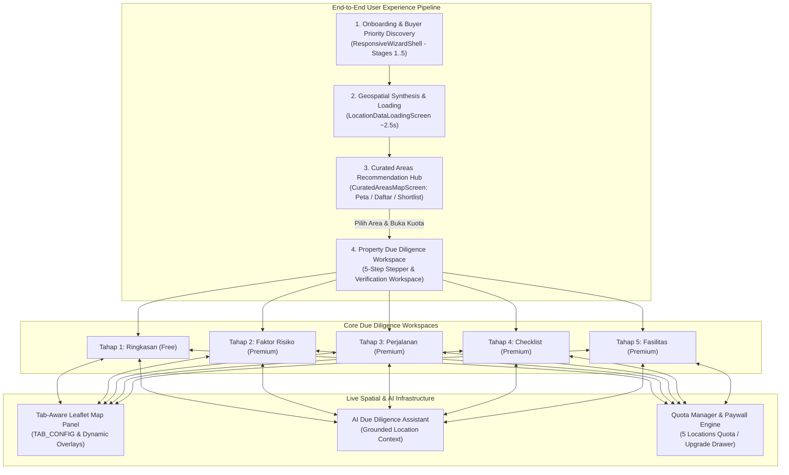
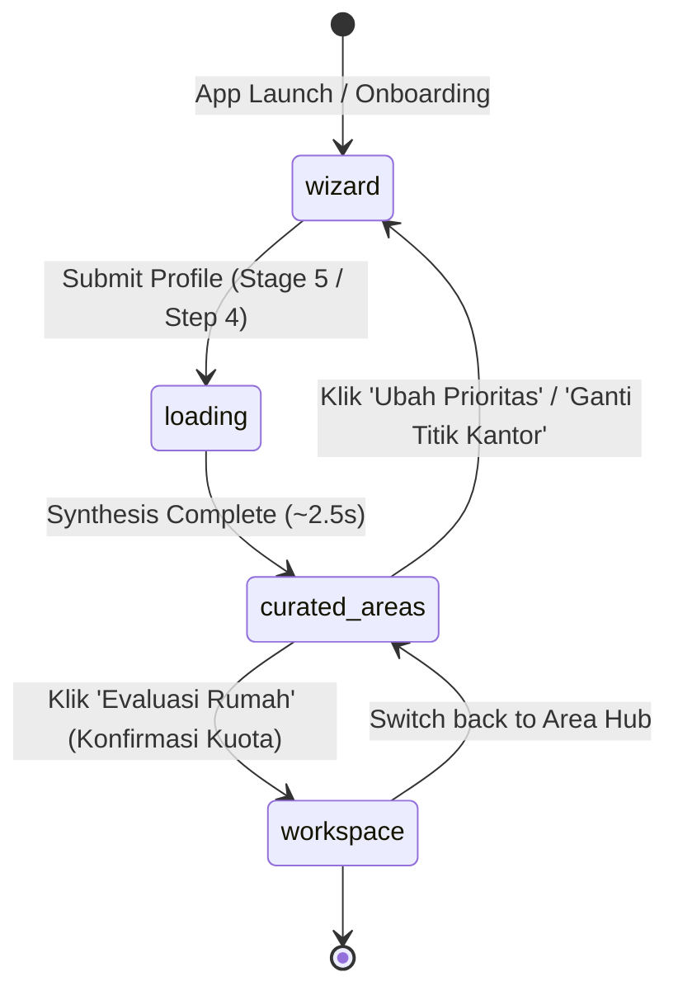
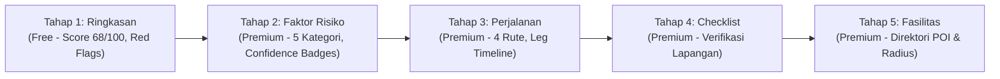

# PRD-00: Master Overview & Central Requirements Specification

## Metadata

| Field | Value |
|---|---|
| **Document Title** | Rumper Master Overview & Central Requirements Specification |
| **Document ID** | `PRD-00` |
| **Author** | Rumper Product Management & Engineering Architecture |
| **Status** | Approved / Living Production Baseline |
| **Version** | 3.0 (Master Unified Baseline) |
| **Target Path** | [`docs/prd/PRD-00-overview-architecture.md`](file:///Users/arisandy/Downloads/Rumper%20App/rumper-web-gamification-main/docs/prd/PRD-00-overview-architecture.md) |
| **Baseline Standards** | [`PRODUCT.md`](file:///Users/arisandy/Downloads/Rumper%20App/rumper-web-gamification-main/PRODUCT.md), [`DESIGN.md`](file:///Users/arisandy/Downloads/Rumper%20App/rumper-web-gamification-main/DESIGN.md), [`docs/README.md`](file:///Users/arisandy/Downloads/Rumper%20App/rumper-web-gamification-main/docs/README.md) |
| **Modular PRD Map** | `PRD-01` through `PRD-14` |
| **Owning Workstreams** | `Product_Management`, `Frontend_Engineering`, `GIS_Telemetry`, `Design_System`, `AI_Systems` |

---

## 1. Executive Summary & Product Mission

**Rumper** is a gamified spatial intelligence and property due-diligence platform designed for Indonesian first-time homebuyers and property seekers in Jabodetabek. It solves the friction of evaluating complex geospatial risks (flooding, liquefaction, transit bottlenecks, legal gaps, facility deficits) by translating raw geospatial and environmental data into an intuitive, guided, and interactive decision journey.

This Master Overview PRD serves as the **centralized source of truth** capturing all functional, spatial, technical, and UX requirements currently implemented in the codebase.

---

## 2. Core Product Principles & Safety Guardrails

1. **Non-Negotiable Red Flag Exposure (STD-SCR-001 §7)**: Critical safety red flags (severe flood zone, liquefaction, hazardous fault buffers) **must never be hidden or softened** behind a paywall or personalized scoring. They are prominently exposed on Tahap 1 `Ringkasan` with direct map highlight links.
2. **Progressive Disclosure & Low Cognitive Load**: Complex criteria are gathered via structured stages ($\le 4$ working memory options per stage) and scenario-led trade-off calibrations rather than exhausting preference forms.
3. **Bidirectional Spatial-Analytical Proof Loop**: Every textual insight, risk score, commute friction, and amenity count is paired with live Leaflet map verification (`map.flyTo`, hazard polygons, transit polylines, 500m walk circles, POI pins).
4. **Transparent Freemium Value Anchoring**: Free users enjoy full access to Tahap 1 `Ringkasan` (overall score, verdict, red flags, factor summary) with high-value conversion triggers (Rp50.000 promotional anchor vs Rp150.000 regular price) for unlocking deep-dive evidence, checklists, and expert analyst consultations.

---

## 3. Architecture & Global State Topology

### 3.1 Global Application Flow State (`App.tsx`)

The application state machine controls 4 primary lifecycle views:

| State Key | Active Component | Description & Transitions |
|---|---|---|
| `"wizard"` | `ResponsiveWizardShell` | 5-stage onboarding wizard collecting buyer profile, gravity anchors, budget telemetry, and dilemma trade-offs. Transitions to `"loading"` on completion. |
| `"loading"` | `LocationDataLoadingScreen` | 4-phase animated telemetry synthesis (~2.5s) synthesizing gravity centers and GIS corridor layers. Automatically transitions to `"curated-areas"`. |
| `"curated-areas"` | `CuratedAreasMapScreen` | Spatial recommendation hub with 3 view modes (`peta`, `daftar`, `shortlist`), corridor detail drawer, area comparison modal, and quota deduction gate. Transitions to `"workspace"` when a property is evaluated. |
| `"workspace"` | Core Due Diligence Workspace | 5-step property due diligence stepper with split-view Leaflet map, mobile bottom sheet, AI assistant, and upgrade drawers. |

---

## 4. Comprehensive Functional Requirements (Implemented Modules)

### Module 1: Onboarding & Buyer Priority Discovery (`ResponsiveWizardShell`)

- **FR-W01: 5-Stage Cognitive Architecture**:
  - **Stage 1 (Friction Discovery & Bridge)**: Identifies buyer friction across 3 pillars (`Akses & Komuter`, `Banjir & Lingkungan`, `Budget & Legalitas`) accompanied by animated bridge illustration explainers.
  - **Stage 2 (Value Proof)**: Interactive telemetry demonstration showcasing how Rumper protects buyers from hidden neighborhood traps.
  - **Stage 3 (Empathy Statement)**: Empathy validation acknowledging first-time homebuyer anxiety in Jabodetabek.
  - **Stage 4 (Scenario-led Trade-off Calibration)**: 3 realistic Jabodetabek housing dilemmas (e.g. Flood safety vs Commute time vs Lot size) with horizontal swipe physics ($|\Delta X| > |\Delta Y| \times 1.5$) to prevent vertical scroll collisions.
  - **Stage 5 (Parameter Setup - 4 Sub-steps)**:
    - *Step 1 (Household & Work)*: Household composition (`single`, `pasangan`, `keluarga-muda`) and work mobility (`wfo`, `hybrid`, `remote`).
    - *Step 2 (Location & Activity Anchors)*: Primary activity center (e.g. Sudirman/SCBD) and secondary anchor (e.g. Mega Kuningan/Rasuna Said).
    - *Step 3 (Budget Range & KPR Telemetry)*: Dynamic range slider (Rp 200 Jt – 5 M) with preset pills and live monthly KPR cashflow estimation based on 20-year tenor and 7.5% fixed interest.
    - *Step 4 (Corridor Selection & Review)*: Corridor preferences (Tangerang Selatan, Depok/Bogor, Bekasi, Jakarta Timur/Fringe) and final constraint confirmation.
- **FR-W02: Progress Tracking**: Unified 9-step progress indicator on desktop sidebar (`DesktopSidebar`) and mobile header (`MobileHeader`).
- **FR-W03: Skip & Jump Actions**: Ability to jump directly between stages or bypass friction discovery to parameter setup.

---

### Module 2: Geospatial Synthesis & Loading Transition (`LocationDataLoadingScreen`)

- **FR-L01: 4-Phase Telemetry Synthesis**:
  1. *Phase 1 (0–25%)*: Mengalibrasi titik gravitasi harian & rute komuter...
  2. *Phase 2 (25–55%)*: Menyinkronkan batas genangan air & kontur elevasi spasial...
  3. *Phase 3 (55–85%)*: Menghitung isolasi waktu tempuh komut transit & akses tol...
  4. *Phase 4 (85–100%)*: Memvalidasi kelayakan fasilitas & menyusun koridor terkurasi...
- **FR-L02: Visual Telemetry Elements**: Circular pulse radar, dynamic milestone checklist with checkmark transitions, and auto-completion event callback.

---

### Module 3: Curated Areas Recommendation Hub (`CuratedAreasMapScreen`)

- **FR-C01: 3-Tier Suitability Classification (Non-Ranking Fit)**:
  - 🟢 **Strong Fit**: Memenuhi preferensi utama, proteksi dealbreaker (bebas genangan), & toleransi commute dalam batas aman.
  - 🟡 **Interesting Trade-off**: Sangat kuat di 1–2 dimensi kunci, namun memiliki 1 kompromi nyata terukur (e.g. tanah lebih padat).
  - 🔴 **Opsi Alternatif**: Rekomendasi bernilai tinggi di luar asumsi awal (e.g. tanah 2x lebih luas via akses ekspres).
- **FR-C02: 3 View Modes**:
  - **Mode Peta (`peta`)**: 1/3 interactive carousel sidebar + 2/3 full Leaflet spatial map.
  - **Mode Daftar (`daftar` - `DaftarAksesibelView`)**: Responsive grid directory with category pills, price filters, commute sorting, and search query matching.
  - **Mode Shortlist (`shortlist` - `ShortlistAreasView`)**: Bookmarked area manager with multi-select area comparison launcher.
- **FR-C03: Spatial Telemetry & GIS Layers**:
  - Sudirman Gravity Center marker with custom SVG pulse icon.
  - Real corridor GPS pins with category-colored badges.
  - Multimodal route polylines connecting corridor coordinates directly to Sudirman transit center.
  - River basin flood hazard polygons (Ciliwung, Kali Bekasi, Cisadane) with warning popups.
  - Live elevation tags (mdpl) and flood risk classification (`Aman`, `Waspada`, `Tinggi`).
- **FR-C04: Modals & Drawers**:
  - `AreaDetailDrawer`: Comprehensive corridor breakdown, pros/cons, transit options (KRL, Tol, MRT, LRT), essential amenities, and price/m².
  - `AreaComparisonModal`: Side-by-side comparative matrix comparing 2–3 shortlisted areas across 6 key metrics.
  - `UnlockAreaQuotaModal`: Quota deduction confirmation dialog displaying remaining quota (e.g. `1 dari 5 kuota`) before entering property workspace.
  - Re-calibration triggers: `Ubah Prioritas` opens wizard pre-filled; `Ganti Titik Kantor` jumps directly to Step 2.

---

### Module 4: 5-Step Property Due Diligence Workspace

#### Step 1: Ringkasan (`ScoreCard`, `FactorRisksCard`, `UpgradeBanner`, `LockedStepCard`)
- **FR-S01: Score Gauge & Verdict**: SVG circular gauge displaying overall score `68/100` and verdict badge (`INVESTIGASI` / `LANJUTKAN` / `TUNDA`).
- **FR-S02: Dealbreaker & Critical Red Flags**: Highlighted warning card displaying critical hazards (e.g., *Risiko banjir 5 tahunan di akses gerbang utama*), with `Perluas Peta` trigger focusing the map on the hazard polygon.
- **FR-S03: 5-Factor Risk Summary**: Compact bars for Banjir (42), Perjalanan (58), Akses (76), Fasilitas (84), and Lingkungan (70) with `Tampilkan semua faktor ▾` toggle.
- **FR-S04: Promotional Upgrade Banner**: Dark banner (`bg-[#061E28]`) with promotional pricing anchor `Rp50.000` (struck-through `Rp150.000`) and `Buka Semua Tahap` CTA.
- **FR-S05: Locked Step Cards / Teasers**: Dashed cards for Tahap 2–5 with lock icons and `Buka` upgrade triggers.

#### Step 2: Faktor Risiko (`DeepDiveEvidenceWorkspace`)
- **FR-S06: 5 Risk Category Tabs**: Category navigation with individual scores, severity tags (`RISIKO UTAMA`, `PERLU VALIDASI`), and evidence counts.
- **FR-S07: Evidence Confidence Badges**: Evidence items tagged with confidence levels (`Data Kuat`, `Data Sedang`, `Perlu Validasi`).
- **FR-S08: Spatial Evidence & Data Gaps**: Detailed historical flood records, elevation delta relative to surrounding roads, and `Tambahkan ke checklist` action on gap cards.

#### Step 3: Perjalanan (`CommuteWorkspace`)
- **FR-S09: 4 Multimodal Commute Routes**: KRL Commuter Line, Tol (Mobil), Arteri (Motor), and Rute Sekolah / Sekitar.
- **FR-S10: Multi-Leg Journey Timelines**: Detailed leg breakdown (e.g., Ojol 10 min $\rightarrow$ KRL 32 min $\rightarrow$ Walk 5 min) with distance, cost, and bottleneck alerts.
- **FR-S11: Checklist Integration**: `Tambahkan ke checklist` action with auto-navigation to Step 4 after 600ms.

#### Step 4: Checklist (`ChecklistWorkspace`)
- **FR-S12: Structured Field Inspection**: Categorized checklist items (Banjir & Drainase, Akses Jalan, Legalitas & Dokumen, Fasilitas Lingkungan).
- **FR-S13: Progress & Notes**: Interactive check toggles, real-time completion counter (e.g., `2/7 selesai`), and user field notes.
- **FR-S14: Analyst Review CTA**: Direct CTA `Minta tinjauan analis` routing to professional verification support.

#### Step 5: Fasilitas (`FasilitasWorkspace`)
- **FR-S15: POI Directory & Distance Sorting**: Categorized amenities (Kesehatan, Pendidikan, Belanja, Transportasi) sorted by proximity.
- **FR-S16: Proximity Badges & Map Sync**: Distance indicators (e.g., `450 m`, `1.2 km`) with interactive pin highlight on map hover/click.

---

### Module 5: Interactive Leaflet Map Panel (`MapPanel.tsx`)

- **FR-M01: Tab-Aware Configuration Matrix (`TAB_CONFIG`)**:
  - `Ringkasan`: Center `[-6.266, 106.990]`, Zoom 15, Property marker, Flood polygon, 500m radius circle, POI pins.
  - `Faktor risiko`: Center `[-6.263, 106.990]`, Zoom 14, High-opacity flood polygon, liquefaction overlay, elevation contours.
  - `Perjalanan`: Center `[-6.255, 106.985]`, Zoom 12, 4 color-coded route polylines (KRL green, Tol blue, Arteri orange, Sekolah purple) and station markers.
  - `Checklist`: Center `[-6.266, 106.990]`, Zoom 15, 500m walkability buffer circle, inspection target pins.
  - `Fasilitas`: Center `[-6.263, 106.990]`, Zoom 13, Category-filtered POI markers with custom popups.
- **FR-M02: Camera Transitions**: Smooth `map.flyTo` animations ($0.75\text{s}$ duration) triggered on active tab switch or red flag click.
- **FR-M03: Map Controls**: Fullscreen modal expansion, recenter button, layer filter toggle pills, and custom info overlay bar.

---

### Module 6: Mobile & Responsive Experience

- **FR-R01: Bottom Navigation Bar (`MobileBottomNav`)**: 4 primary tabs (`Workspace`, `Peta`, `Asisten AI`, `Profil`) with active state styling and badge counts.
- **FR-R02: 4-Level Bottom Sheet (`MobileBottomSheet`)**:
  - `peek` ($80\text{px}$): Minimal map viewport peek.
  - `compact` ($260\text{px}$): Score summary and primary actions.
  - `half` ($50\text{vh}$): Half-screen workspace view.
  - `full` ($90\text{vh}$): Full workspace view with internal scroll lock.
  - Velocity-sensitive drag physics and touch swipe detection.
- **FR-R03: Mobile Full Map Mode**: Toggle between floating bottom sheet mode and immersive full-screen map exploration.

---

### Module 7: Entitlements, Quota & Paywall Engine

- **FR-E01: Free Trial Quota Management**: 5 audited property slots per account; dynamic remaining quota counter in header (`1 lokasi tersisa`).
- **FR-E02: Multi-Property Manager (`PropertyModal`)**: Search address/subdistrict, add new property, switch active property, and inspect quota usage.
- **FR-E03: Upgrade Drawer (`UpgradeDrawer`)**:
  - Feature comparison matrix (Free Trial vs Premium Analyst).
  - Promotional price anchor: **Rp50.000** (struck-through regular price **Rp150.000**).
  - Instant WhatsApp checkout routing and payment trigger.
- **FR-E04: Paywall Interception**: Clicking any locked tab (`🔒`), locked card, or premium action opens `UpgradeDrawer`.

---

### Module 8: AI Due Diligence Assistant (`AssistantDrawer`)

- **FR-A01: Grounded Context Injection**: Scoped dynamically to the active property (`name`, `subdistrict`, `score`, `riskSummary`, `evidenceCount`).
- **FR-A02: Preset Recommendation Prompts**:
  - *"Apakah lokasi ini aman dari banjir 5 tahunan?"*
  - *"Berapa estimasi waktu komut ke Sudirman jam 7 pagi?"*
  - *"Apa saja dokumen legalitas krusial yang wajib dicek di lokasi ini?"*
- **FR-A03: Slide-in Drawer Interface**: $420\text{px}$ desktop drawer / full-height mobile overlay with chat history, source citations, and message input.

---

### Module 9: Cross-Tab & Cross-Module Correlations

| Source Action | Source Module | Target Module | Trigger | Resulting State & GIS Action |
|---|---|---|---|---|
| `Perluas Peta / Red Flag` | `ScoreCard` (Tahap 1) | `MapPanel` | Click card | Map pans/zooms to hazard polygon; highlights flood boundary overlay. |
| `Tambahkan ke checklist` | `CommuteWorkspace` | `ChecklistWorkspace` | Click CTA | Appends commute verification item; navigates to Step 4 after $600\text{ms}$; Map switches to 500m walk circle. |
| `Tambahkan ke checklist` | `DeepDiveWorkspace` | `ChecklistWorkspace` | Click gap CTA | Appends risk factor verification item; navigates to Step 4; updates checklist counter. |
| `Evaluasi Rumah` | `CuratedAreasMapScreen` | `UnlockAreaQuotaModal` | Click button | Opens quota confirmation modal; deducts 1 quota; switches app state to `"workspace"`. |
| `Ubah Prioritas` | `CuratedAreasMapScreen` | `ResponsiveWizardShell` | Click header | Re-opens wizard pre-filled with existing form data; resets to chosen stage/step. |
| `Ganti Titik Kantor` | `CuratedAreasMapScreen` | `ResponsiveWizardShell` | Click pin | Opens wizard directly at Step 2 (Location Anchors). |

---

## 5. Technical Component & File Inventory

| Component | Source File Path | Primary Responsibilities & Implemented Features |
|---|---|---|
| **App Root** | [`src/App.tsx`](file:///Users/arisandy/Downloads/Rumper%20App/rumper-web-gamification-main/src/App.tsx) | Flow state controller, active step management, property quota state, section refs, scroll sync. |
| **App Header** | [`src/components/AppHeader.tsx`](file:///Users/arisandy/Downloads/Rumper%20App/rumper-web-gamification-main/src/components/AppHeader.tsx) | Property switcher dropdown, Free Trial badge, quota counter (`1/5 used`), avatar. |
| **SubHeader Tabs** | [`src/components/SubHeaderTabs.tsx`](file:///Users/arisandy/Downloads/Rumper%20App/rumper-web-gamification-main/src/components/SubHeaderTabs.tsx) | Sticky 5-step navigation bar, active step pill, locked state indicators (`🔒`). |
| **Vertical Timeline** | [`src/components/VerticalTimeline.tsx`](file:///Users/arisandy/Downloads/Rumper%20App/rumper-web-gamification-main/src/components/VerticalTimeline.tsx) | Dynamic `ResizeObserver` node coordinate measuring, completed nodes (`✓`), locked nodes (`🔒`). |
| **Score Card** | [`src/components/ScoreCard.tsx`](file:///Users/arisandy/Downloads/Rumper%20App/rumper-web-gamification-main/src/components/ScoreCard.tsx) | SVG circular gauge meter (`68/100`), verdict badge, dealbreaker critical red flag card. |
| **Factor Risks Card** | [`src/components/FactorRisksCard.tsx`](file:///Users/arisandy/Downloads/Rumper%20App/rumper-web-gamification-main/src/components/FactorRisksCard.tsx) | 5 risk factor progress bars with score pills and `Tampilkan semua faktor ▾` accordion. |
| **Upgrade Banner** | [`src/components/UpgradeBanner.tsx`](file:///Users/arisandy/Downloads/Rumper%20App/rumper-web-gamification-main/src/components/UpgradeBanner.tsx) | Dark promo banner with price anchor `Rp50.000` / `Rp150.000` and unlock trigger. |
| **Deep Dive Evidence** | [`src/components/DeepDiveEvidenceWorkspace.tsx`](file:///Users/arisandy/Downloads/Rumper%20App/rumper-web-gamification-main/src/components/DeepDiveEvidenceWorkspace.tsx) | 5 risk categories, confidence badges, spatial evidence cards, gap resolution items. |
| **Commute Workspace** | [`src/components/CommuteWorkspace.tsx`](file:///Users/arisandy/Downloads/Rumper%20App/rumper-web-gamification-main/src/components/CommuteWorkspace.tsx) | 4 multimodal routes, leg breakdowns, bottleneck friction cards, checklist auto-nav. |
| **Checklist Workspace** | [`src/components/ChecklistWorkspace.tsx`](file:///Users/arisandy/Downloads/Rumper%20App/rumper-web-gamification-main/src/components/ChecklistWorkspace.tsx) | Grouped field inspection checklist, completion progress, note inputs, analyst review CTA. |
| **Fasilitas Workspace** | [`src/components/FasilitasWorkspace.tsx`](file:///Users/arisandy/Downloads/Rumper%20App/rumper-web-gamification-main/src/components/FasilitasWorkspace.tsx) | POI directory (health, school, shopping, station), distance sorting, radius filters. |
| **Map Panel** | [`src/components/MapPanel.tsx`](file:///Users/arisandy/Downloads/Rumper%20App/rumper-web-gamification-main/src/components/MapPanel.tsx) | Leaflet GIS canvas, `TAB_CONFIG` overlays, hazard polygons, route polylines, 500m walk circle. |
| **Mobile Bottom Nav** | [`src/components/MobileBottomNav.tsx`](file:///Users/arisandy/Downloads/Rumper%20App/rumper-web-gamification-main/src/components/MobileBottomNav.tsx) | 4-tab mobile navigation bar with active indicators and notification badges. |
| **Mobile Bottom Sheet** | [`src/components/MobileBottomSheet.tsx`](file:///Users/arisandy/Downloads/Rumper%20App/rumper-web-gamification-main/src/components/MobileBottomSheet.tsx) | 4 snap levels (`peek`, `compact`, `half`, `full`), touch velocity drag gestures. |
| **Upgrade Drawer** | [`src/components/UpgradeDrawer.tsx`](file:///Users/arisandy/Downloads/Rumper%20App/rumper-web-gamification-main/src/components/UpgradeDrawer.tsx) | Slide-in paywall drawer, feature matrix, promo pricing, WhatsApp / Checkout CTA. |
| **Assistant Drawer** | [`src/components/AssistantDrawer.tsx`](file:///Users/arisandy/Downloads/Rumper%20App/rumper-web-gamification-main/src/components/AssistantDrawer.tsx) | AI Assistant slide-in drawer with property-grounded context, preset prompt chips. |
| **Property Modal** | [`src/components/PropertyModal.tsx`](file:///Users/arisandy/Downloads/Rumper%20App/rumper-web-gamification-main/src/components/PropertyModal.tsx) | Multi-property switcher and location addition dialog with quota tracking. |
| **Wizard Shell** | [`src/components/wizard/ResponsiveWizardShell.tsx`](file:///Users/arisandy/Downloads/Rumper%20App/rumper-web-gamification-main/src/components/wizard/ResponsiveWizardShell.tsx) | 5-stage onboarding wizard shell, desktop sidebar, mobile header, sticky footer. |
| **Wizard Store** | [`src/store/useWizardStore.ts`](file:///Users/arisandy/Downloads/Rumper%20App/rumper-web-gamification-main/src/store/useWizardStore.ts) | Centralized Zustand/React store managing buyer profile, budget, dilemmas, and stages. |
| **Loading Screen** | [`src/components/curated-areas/LocationDataLoadingScreen.tsx`](file:///Users/arisandy/Downloads/Rumper%20App/rumper-web-gamification-main/src/components/curated-areas/LocationDataLoadingScreen.tsx) | 4-stage animated geospatial synthesis progress screen (~2.5s). |
| **Curated Areas Screen** | [`src/components/curated-areas/CuratedAreasMapScreen.tsx`](file:///Users/arisandy/Downloads/Rumper%20App/rumper-web-gamification-main/src/components/curated-areas/CuratedAreasMapScreen.tsx) | Main recommendation hub with Map, Directory, Shortlist views, and GIS telemetry. |
| **Area Detail Drawer** | [`src/components/curated-areas/AreaDetailDrawer.tsx`](file:///Users/arisandy/Downloads/Rumper%20App/rumper-web-gamification-main/src/components/curated-areas/AreaDetailDrawer.tsx) | Full corridor profile drawer, transit breakdown, pros/cons, essential amenities. |
| **Area Comparison Modal** | [`src/components/curated-areas/AreaComparisonModal.tsx`](file:///Users/arisandy/Downloads/Rumper%20App/rumper-web-gamification-main/src/components/curated-areas/AreaComparisonModal.tsx) | Multi-area side-by-side comparison matrix across 6 quantitative and qualitative dimensions. |
| **Unlock Quota Modal** | [`src/components/curated-areas/UnlockAreaQuotaModal.tsx`](file:///Users/arisandy/Downloads/Rumper%20App/rumper-web-gamification-main/src/components/curated-areas/UnlockAreaQuotaModal.tsx) | Quota deduction confirmation modal (1 of 5 quota) before workspace initialization. |

---

## 6. Non-Functional & Design System Standards

- **Design System Tokens**:
  - Forest Deep / Canvas: `#001E2B`, `#061E28`, `#F6F8F7`, `#FFFFFF`
  - Emerald Primary / Success: `#00684A`, `#00ED64`, `#E3FCEF`
  - Hazard Red / Primary Risk: `#DC2626`, `#EF4444`, `#FEE2E2`
  - Warning Amber: `#D97706`, `#F59E0B`, `#FEF3C7`
  - Transit Blue: `#2563EB`, `#DBEAFE`
  - Slate Neutral: `#0F172A`, `#334155`, `#64748B`, `#94A3B8`, `#CBD5E1`, `#E2E8F0`
- **Accessibility & Touch Ergonomics (WCAG 2.2 AA)**:
  - Contrast ratios $\ge 4.5:1$ for normal text, $\ge 3:1$ for graphical UI boundaries.
  - Interactive hit targets $\ge 44\times 44\text{px}$ across all buttons, pills, and touch toggles.
  - Form controls with explicit ARIA tags (`aria-label`, `aria-valuenow`, `aria-valuemin`, `aria-valuemax`).
  - Tabular numeric alignment (`tabular-nums font-mono`) for scores, prices, and time estimates to prevent layout shifts.
  - Keyboard navigation focus rings (`focus-visible:ring-2 focus-visible:ring-[#00684a]`).

---

## 7. Modular PRD Cross-Reference Matrix

This Master Overview unifies and references the detailed modular PRDs:

| Document ID | Title | Scope & Detailed Focus |
|---|---|---|
| **[`PRD-01`](file:///Users/arisandy/Downloads/Rumper%20App/rumper-web-gamification-main/docs/prd/PRD-01-app-header-navigation.md)** | App Header Navigation | Active property switcher, quota pill, status badge, avatar. |
| **[`PRD-02`](file:///Users/arisandy/Downloads/Rumper%20App/rumper-web-gamification-main/docs/prd/PRD-02-location-risk-workspace.md)** | Location Risk Workspace | Circular score gauge, verdict card, dealbreakers, risk summary accordion. |
| **[`PRD-03`](file:///Users/arisandy/Downloads/Rumper%20App/rumper-web-gamification-main/docs/prd/PRD-03-interactive-map-panel.md)** | Interactive Map Panel | Leaflet map canvas, polygon hazard layers, camera `flyTo`, POI pins. |
| **[`PRD-04`](file:///Users/arisandy/Downloads/Rumper%20App/rumper-web-gamification-main/docs/prd/PRD-04-entitlements-upgrade.md)** | Entitlements & Upgrade Paywall | Free trial quota, promo price anchoring, locked step teasers, upgrade drawer. |
| **[`PRD-05`](file:///Users/arisandy/Downloads/Rumper%20App/rumper-web-gamification-main/docs/prd/PRD-05-deep-dive-workspaces.md)** | Deep Dive Workspaces Overview | Architecture for Tahap 2–5 workspaces. |
| **[`PRD-05A`](file:///Users/arisandy/Downloads/Rumper%20App/rumper-web-gamification-main/docs/prd/PRD-05A-tahap-02-faktor-risiko.md)** | Tahap 02: Faktor Risiko | 5 risk factor categories, confidence badges, spatial evidence, data gaps. |
| **[`PRD-05B`](file:///Users/arisandy/Downloads/Rumper%20App/rumper-web-gamification-main/docs/prd/PRD-05B-tahap-03-perjalanan-komut.md)** | Tahap 03: Perjalanan Komut | 4 commute routes, leg breakdowns, bottleneck friction, checklist trigger. |
| **[`PRD-05C`](file:///Users/arisandy/Downloads/Rumper%20App/rumper-web-gamification-main/docs/prd/PRD-05C-tahap-04-checklist-lapangan.md)** | Tahap 04: Checklist Lapangan | Grouped field verification checklist, progress tracking, analyst review CTA. |
| **[`PRD-05D`](file:///Users/arisandy/Downloads/Rumper%20App/rumper-web-gamification-main/docs/prd/PRD-05D-tahap-05-fasilitas-poi.md)** | Tahap 05: Fasilitas POI | Amenity directory, radius filtering, proximity sorting, map sync. |
| **[`PRD-06`](file:///Users/arisandy/Downloads/Rumper%20App/rumper-web-gamification-main/docs/prd/PRD-06-ai-assistant.md)** | AI Due Diligence Assistant | Grounded location context, preset prompt chips, slide-in drawer. |
| **[`PRD-07`](file:///Users/arisandy/Downloads/Rumper%20App/rumper-web-gamification-main/docs/prd/PRD-07-mobile-bottom-nav-shell.md)** | Mobile Bottom Nav Shell | 4-tab mobile navigation bar and responsive layout shell. |
| **[`PRD-08`](file:///Users/arisandy/Downloads/Rumper%20App/rumper-web-gamification-main/docs/prd/PRD-08-mobile-bottom-sheet-workspace.md)** | Mobile Bottom Sheet Workspace | 4 snap states (`peek`, `compact`, `half`, `full`), touch drag physics. |
| **[`PRD-09`](file:///Users/arisandy/Downloads/Rumper%20App/rumper-web-gamification-main/docs/prd/PRD-09-mobile-full-map-experience.md)** | Mobile Full Map Experience | Fullscreen map exploration mode for mobile devices. |
| **[`PRD-10`](file:///Users/arisandy/Downloads/Rumper%20App/rumper-web-gamification-main/docs/prd/PRD-10-cross-tab-map-correlation-matrix.md)** | Cross-Tab Map Correlation Matrix | Bi-directional event bus, auto-nav delay (600ms), map zoom triggers. |
| **[`PRD-11`](file:///Users/arisandy/Downloads/Rumper%20App/rumper-web-gamification-main/docs/prd/PRD-11-personalized-buyer-decision-journey.md)** | Buyer Priority Discovery | 5-stage onboarding wizard, scenario trade-offs, persistent profile store. |
| **[`PRD-12`](file:///Users/arisandy/Downloads/Rumper%20App/rumper-web-gamification-main/docs/prd/PRD-12-curated-areas-map-and-shortlist.md)** | Curated Areas Map & Shortlist | Recommendation hub, GIS telemetry, detail drawer, comparison matrix. |
| **[`PRD-13`](file:///Users/arisandy/Downloads/Rumper%20App/rumper-web-gamification-main/docs/prd/PRD-13-quota-pricing-account-management.md)** | Quota, Pricing & Account Hub | Quota lifecycle, multi-tier monetization, instant in-app payment, account settings & PDF export. |
| **[`PRD-14`](file:///Users/arisandy/Downloads/Rumper%20App/rumper-web-gamification-main/docs/prd/PRD-14-property-modal-location-switcher.md)** | Property Switcher & Scenarios | Multi-property modal, quota lifecycle states, 1-location / multi-location / zero quota scenarios, and GIS sync. |
