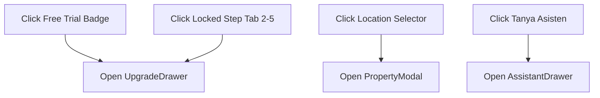

# PRD-01: App Header & Navigation System

## Metadata

| Field | Value |
|---|---|
| **Author** | Rumper Product Agent & Senior PM |
| **Status** | Approved / Active Production Specification |
| **Created** | 2026-08-22 |
| **Version** | 2.0 |
| **Target Path** | [`docs/prd/PRD-01-app-header-navigation.md`](file:///Users/arisandy/Downloads/Rumper%20App/rumper-web-gamification-main/docs/prd/PRD-01-app-header-navigation.md) |
| **Baseline Documents** | [`PRD-00-overview-architecture.md`](file:///Users/arisandy/Downloads/Rumper%20App/rumper-web-gamification-main/docs/prd/PRD-00-overview-architecture.md) |
| **Owning Workstreams** | `Product_Management`, `Design_System`, `Frontend_Engineering` |

---

## 1. Summary

The **App Header & Navigation System** establishes the primary navigation frame for Rumper. It houses branding, plan tier badges (`Free Trial` / `Premium`), location selection controls (`Grand Galaxy City Block R`), evaluation quota telemetry (`1 lokasi tersisa`), step navigation tabs (`Ringkasan`, `Faktor risiko`, `Perjalanan`, `Checklist`, `Fasilitas`), and quick-action triggers (`Tanya Asisten` & `Upgrade`).

---

## 2. Product Objective

- **Contextual Awareness**: Ensure users always know which property location they are auditing and how many location searches remain in their quota.
- **Conversion Touchpoints**: Provide intuitive header triggers ("Free Trial" pill badge, locked step tabs) that seamlessly open the `UpgradeDrawer`.
- **Responsive Navigation**: Adapt between desktop sticky top navigation and mobile bottom sheet navigation without layout breakage.

---

## 3. User Outcome (Per-Component Goals)

| Component | Primary User Goal | Key Visual / Interaction |
|---|---|---|
| `AppHeader.tsx` | View active property, search quota, and subscription plan status. | Dark `#061E28` bar, shield logo, Free Trial badge, location selector, quota pill, profile button. |
| `SubHeaderTabs.tsx` | Switch between evaluation steps and trigger AI Assistant. | Step tabs with lock icons for locked stages, light blue "Tanya Asisten" pill button. |
| `MobileBottomNav.tsx` | Navigate evaluation views on mobile screens (<768px). | Fixed bottom bar with icons for Map, Summary, Upgrade, and AI Assistant. |

---

## 4. Scope Boundaries

### In Scope
- **Header Telemetry**: Quota badge (`1 lokasi tersisa`), plan badge (`Free Trial` / `Premium`), property location selector (`Grand Galaxy City Block R, Bekasi Selatan`).
- **Auto-Hide Behavior**: Smooth CSS translate header auto-hide on scroll (>20px).
- **Tab Gating Hooks**: Triggering `UpgradeDrawer` when locked step tabs are clicked.
- **AI Assistant Trigger**: Opening `AssistantDrawer` on "Tanya Asisten" click.

### Out of Scope
- **Backend Auth Flow**: Login / signup modal UI (profile icon acts as mock trigger).
- **Payment Processing**: Live credit card / QRIS payment gateway inside header.

---

## 5. Functional Requirements

| FR-ID | Category | Requirement Description | Priority |
|---|---|---|---|
| **FR-101** | Header Bar | Render top header bar with solid dark background `#001E2B` and smooth scroll auto-hide behavior. | Must Have |
| **FR-102** | Brand Mark | Render Rumper shield mark (`#001E2B` background with `#00ED64` green stroke shield SVG) and bold brand name. | Must Have |
| **FR-103** | Location Picker| Display active property name & subdistrict; open `PropertyModal` on click. | Must Have |
| **FR-104** | Account Button | Display user front name (e.g. `Andi`) with user avatar icon inside interactive rounded pill; open `AccountSettingsScreen` on click. | Must Have |
| **FR-105** | Sub-Header Tabs| Render 5 step tabs in workspace; highlight active step; render lock icons on steps 2–5 for Free Trial users. | Must Have |
| **FR-106** | AI Trigger | Render `"Tanya Asisten"` blue pill button (`#EBF3FF`, `#1A60F5`); open `AssistantDrawer` on click. | Must Have |

---

## 6. Business & Product Rules

### 6.1 Header Interaction Matrix



---

## 7. Current vs. Planned Implementation State

| Component | Built Prototype State (Current) | Planned Target State |
|---|---|---|
| `AppHeader.tsx` | Fully built with auto-hide scroll, location selector, quota pill, and plan badge. | User profile dropdown menu & notification drawer. |
| `SubHeaderTabs.tsx` | Fully built with active tab state, locked step tabs, and "Tanya Asisten" trigger. | Dynamic step progress indicator & custom tab ordering. |
| `MobileBottomNav.tsx` | Built for mobile viewports (<768px). | Haptic feedback on tap & offline state indicators. |

---

## 8. Technical Specs & TypeScript Interfaces

```typescript
export interface AppHeaderProps {
  isPremium: boolean
  onUpgrade: () => void
  activePropertyName: string
  activePropertySubdistrict: string
  remainingQuota: number
  totalQuota: number
  onOpenPropertyModal: () => void
}

export interface SubHeaderTabsProps {
  activeTab: string
  onTabChange: (tab: string) => void
  isPremium: boolean
  onUpgrade: () => void
  onOpenAssistant: () => void
}
```

---

## 9. Acceptance Criteria

- [x] Header maintains `#061E28` dark background and hides smoothly when scrolling down >20px.
- [x] Location selector pill displays `${activePropertyName}, ${activePropertySubdistrict}` and opens `PropertyModal`.
- [x] Locked tabs display lock icons and reliably invoke `onUpgrade()`.
- [x] "Tanya Asisten" blue pill opens `AssistantDrawer`.
