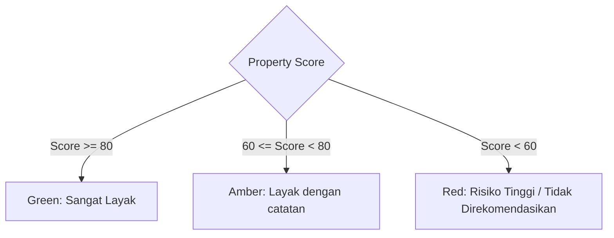

# PRD-02: Location Risk Workspace (Tahap 1)

## Metadata

| Field | Value |
|---|---|
| **Author** | Rumper Product Agent & Senior PM |
| **Status** | Approved / Active Production Specification |
| **Created** | 2026-08-22 |
| **Version** | 2.0 |
| **Target Path** | [`docs/prd/PRD-02-location-risk-workspace.md`](file:///Users/arisandy/Downloads/Rumper%20App/rumper-web-gamification-main/docs/prd/PRD-02-location-risk-workspace.md) |
| **Baseline Documents** | [`PRD-00-overview-architecture.md`](file:///Users/arisandy/Downloads/Rumper%20App/rumper-web-gamification-main/docs/prd/PRD-00-overview-architecture.md) |
| **Owning Workstreams** | `Product_Management`, `UI_Engineering`, `Scoring_Engine` |

---

## 1. Summary

The **Location Risk Workspace** specifies the default evaluation view for Tahap 1 (*Ringkasan & Indeks Risiko Lokasi*). It delivers an instant score summary (`68/100`), verdict badge (`Layak dengan catatan`), radial SVG ring gauge, transparent 5-factor risk rows, evidence metadata telemetry, dynamic vertical timeline node alignment, and locked previews for upcoming evaluation stages.

---

## 2. Product Objective

- **Instant Suitability Assessment**: Enable property seekers to evaluate location quality within 5 seconds of loading a property.
- **Transparent Risk Telemetry**: Deconstruct overall scores into 5 distinct risk categories (Flood, Commute, Physical Access, Facilities, Safety).
- **Stepped Guidance**: Guide users through sequential due diligence via a dynamic vertical timeline.

---

## 3. User Outcome (Per-Card Goals)

| Component | Primary User Goal | Deliverable / View |
|---|---|---|
| `ScoreCard.tsx` | View overall property score, verdict badge, radial gauge, and evidence source count. | Score 68/100, amber verdict badge, SVG ring gauge, verified source pill. |
| `FactorRisksCard.tsx` | Inspect individual risk factor scores, primary risk alerts, and evidence status. | 5 factor rows (Banjir, Perjalanan, Akses, Fasilitas, Keamanan) with mini progress bars. |
| `VerticalTimeline.tsx` | Visualize progressive evaluation flow. | Dynamic 3-node timeline line connecting workspace card anchors. |
| `LockedStepCard.tsx` | Preview locked evaluation stages (Tahap 2–5). | Dashed container with lock icon and "Buka" CTA button. |

---

## 4. Scope Boundaries

### In Scope
- **Deterministic Scoring (STD-SCR-001)**: Displaying overall score (0–100) and risk category scores.
- **5 Monitored Factors**: Banjir (`42/100`, `Risiko utama`), Perjalanan (`58/100`), Akses Fisik (`67/100`), Fasilitas (`74/100`), Keamanan (`81/100`).
- **Dynamic Timeline Alignment**: `ResizeObserver` math calculating vertical node offset positions.
- **Accordion Control**: Smooth expand/collapse of factor rows.

### Out of Scope
- **Custom User Weighting**: User customization of risk weightings (handled in backend engine).
- **Manual Data Override**: Overriding deterministic scores manually in client state.

---

## 5. Functional Requirements

| FR-ID | Category | Requirement Description | Priority |
|---|---|---|---|
| **FR-201** | Score Display | Display numerical score (e.g., `68`) alongside tabular denominator `/100` in navy text `#0F2B38`. | Must Have |
| **FR-202** | Verdict Badge | Render status pill (`score >= 80`: green; `60–79`: amber `Layak dengan catatan`; `<60`: red). | Must Have |
| **FR-203** | Radial Gauge | Render 68px radial SVG ring gauge with filled stroke offset matching score percentage and centered shield icon. | Must Have |
| **FR-204** | Risk Rows | Render 5 risk factor rows with colored category icon, mini progress bar, score numerator, and status pill. | Must Have |
| **FR-205** | Primary Risk | Highlight primary hazard (Flood `42/100`) with red badge pill `Risiko utama`. | Must Have |
| **FR-206** | Timeline Nodes | Render vertical timeline line with node 1 (green check), node 2 (green check), and node 3 (slate lock). | Must Have |
| **FR-207** | Locked Cards | Render disabled stage cards for Tahap 2–5 with mint green `"Buka"` CTA opening `UpgradeDrawer`. | Must Have |

---

## 6. Business & Product Rules

### 6.1 Verdict Badge Rule Matrix



---

## 7. Current vs. Planned Implementation State

| Component | Built Prototype State (Current) | Planned Target State |
|---|---|---|
| `ScoreCard.tsx` | Built with 68/100 score, amber verdict, SVG gauge, verified data pill. | Live score breakdown tooltip on hover. |
| `FactorRisksCard.tsx` | Built with 5 factor rows, mini progress bars, expand/collapse accordion. | Interactive inline evidence drawer per factor. |
| `VerticalTimeline.tsx` | Built with dynamic 3-node height measurement via `ResizeObserver`. | Animated pulse on active node. |
| `LockedStepCard.tsx` | Built with dashed border, lock metadata, and "Buka" CTA. | Interactive teaser preview modal on hover. |

---

## 8. Technical Specs & TypeScript Interfaces

```typescript
export interface RiskFactor {
  id: string
  name: string
  score: number
  isPrimary?: boolean
  evidenceText: string
  statusLabel: string
  statusVariant: 'success' | 'warning' | 'danger'
  color: string
}

export interface ScoreCardProps {
  score?: number
  statusText?: string
  description?: string
  verifiedSourcesCount?: number
}
```

---

## 9. Acceptance Criteria

- [x] `ScoreCard` renders score `68/100` with radial SVG ring gauge and amber `"Layak dengan catatan"` badge.
- [x] `FactorRisksCard` renders 5 factor rows with mini progress bars and expands/collapses smoothly.
- [x] `VerticalTimeline` dynamically updates node positioning on window resize.
- [x] Clicking `"Buka"` on any locked card opens `UpgradeDrawer`.
