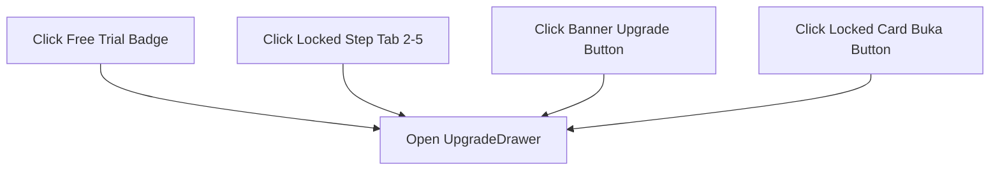

# PRD-04: Entitlements & Upgrade System

## Metadata

| Field | Value |
|---|---|
| **Author** | Rumper Product Agent & Senior PM |
| **Status** | Approved / Active Production Specification |
| **Created** | 2026-08-22 |
| **Version** | 2.0 |
| **Target Path** | [`docs/prd/PRD-04-entitlements-upgrade.md`](file:///Users/arisandy/Downloads/Rumper%20App/rumper-web-gamification-main/docs/prd/PRD-04-entitlements-upgrade.md) |
| **Baseline Documents** | [`PRD-00-overview-architecture.md`](file:///Users/arisandy/Downloads/Rumper%20App/rumper-web-gamification-main/docs/prd/PRD-00-overview-architecture.md) |
| **Owning Workstreams** | `Product_Management`, `Growth_Engine`, `Frontend_Engineering` |

---

## 1. Summary

The **Entitlements & Upgrade System** governs feature access gating, quota limits, and conversion triggers across Rumper. Free Trial users evaluate score overviews in Tahap 1, but must unlock a Premium Location Pass (**Rp50.000** promotional anchor from **Rp150.000** regular price) to access deep risk factor breakdowns, due diligence checklists, commute routing, and analyst consultation services.

---

## 2. Product Objective

- **Drive Free-to-Paid Conversion**: Convert Free Trial users into paying customers using clear value-add teasers and price anchoring.
- **Transparent Gating**: Ensure users understand why a step is locked and what specific capabilities unlock upon upgrading.
- **Trust Guarantee**: Reassure buyers that analysis uses deterministic, verified data (not generative AI guesses).

---

## 3. User Outcome (Per-Component Goals)

| Component | Primary User Goal | Deliverable / View |
|---|---|---|
| `UpgradeBanner.tsx` | View upgrade offer inline within workspace flow. | Dark `#061E28` banner with Rp50.000 green price badge and "Upgrade" CTA. |
| `UpgradeDrawer.tsx` | Inspect unlocked features and complete purchase. | Slide-in drawer with 5 unlocked capabilities, methodology note, and "Upgrade sekarang" CTA. |
| `LockedStepCard.tsx` | Identify locked upcoming evaluation stages. | Dashed container with lock icon and "Buka" CTA button. |

---

## 4. Functional Requirements

| FR-ID | Category | Requirement Description | Priority |
|---|---|---|---|
| **FR-401** | Quota Limit | Enforce 5-location evaluation limit for Free Trial users; surface remaining count. | Must Have |
| **FR-402** | Inline Banner | Render dark upgrade banner (`bg-[#061E28]`) between FactorRisksCard and LockedStepCards. | Must Have |
| **FR-403** | Price Anchor | Display promotional price `Rp50.000` alongside regular strike price `Rp150.000`. | Must Have |
| **FR-404** | Slide Drawer | Render slide-in drawer from right side (`w-[480px]`) with dark backdrop overlay. | Must Have |
| **FR-405** | Feature List | Display 5 unlocked capabilities (Risk breakdown, Red flags, Evidence gaps, Checklist, Recommendations). | Must Have |
| **FR-406** | Trust Note | Display methodology note clarifying deterministic analysis model (non-generative). | Must Have |
| **FR-407** | Unlock Trigger| Set `isTier2Unlocked = true` on "Upgrade sekarang" click and unlock all Tahap 2–5 tabs. | Must Have |

---

## 5. Paywall Trigger Matrix

All locked interactions across the application invoke `setUpgradeOpen(true)`:



---

## 6. Current vs. Planned Implementation State

| Feature | Built Prototype State (Current) | Planned Target State |
|---|---|---|
| `UpgradeBanner.tsx` | Built with Rp50.000 price anchor and Upgrade CTA button. | Dynamic discount timer countdown. |
| `UpgradeDrawer.tsx` | Built with 5 feature unlocks, methodology note, and unlock trigger. | QRIS / Midtrans payment gateway integration. |
| Entitlement State | Simulated in React state (`isTier2Unlocked`). | JWT-backed user entitlement persistence in database. |

---

## 7. Technical Specs & Props Interfaces

```typescript
export interface UpgradeDrawerProps {
  isOpen: boolean
  onClose: () => void
  onUnlock: () => void
  price?: string
  originalPrice?: string
}

export interface UpgradeBannerProps {
  onUpgrade: () => void
  price?: string
  originalPrice?: string
}
```

---

## 8. Acceptance Criteria

- [x] Clicking any locked tab, Free Trial badge, or "Buka" button opens `UpgradeDrawer`.
- [x] `UpgradeDrawer` displays `Rp50.000` promo price and 5 feature checklist items.
- [x] Methodology note explicitly clarifies deterministic verification data model.
- [x] Clicking "Upgrade sekarang" sets `isTier2Unlocked = true` and closes drawer.
