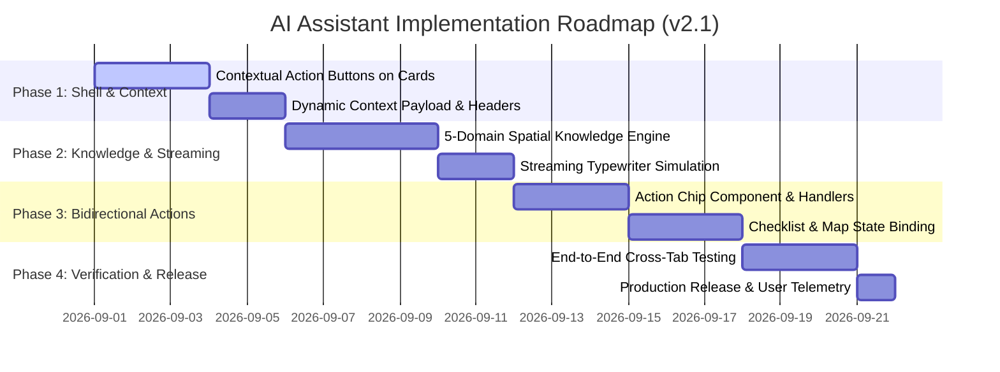

# PRD-06: AI Location Assistant (Rumper Advisor / Tanya Asisten)

## Document Metadata & Governance

| Field | Value |
|---|---|
| **Document ID** | `PRD-06` |
| **Title** | AI Location Assistant & Spatial Insight Advisor ("Rumper Advisor") |
| **Author** | Rumper Product Strategy & Senior Project Management Lead |
| **Status** | Approved / Active Production Specification |
| **Created** | 2026-08-22 |
| **Last Updated** | 2026-08-30 (v2.1 — Workspace Insights & Bidirectional Actions Update) |
| **Version** | 2.1 |
| **Target Path** | [`docs/prd/PRD-06-ai-assistant.md`](file:///Users/arisandy/Downloads/Rumper%20App/rumper-web-gamification-main/docs/prd/PRD-06-ai-assistant.md) |
| **Baseline Documents** | [`PRD-00-overview-architecture.md`](file:///Users/arisandy/Downloads/Rumper%20App/rumper-web-gamification-main/docs/prd/PRD-00-overview-architecture.md), [`PRD-02-location-risk-workspace.md`](file:///Users/arisandy/Downloads/Rumper%20App/rumper-web-gamification-main/docs/prd/PRD-02-location-risk-workspace.md), [`PRD-05-deep-dive-workspaces.md`](file:///Users/arisandy/Downloads/Rumper%20App/rumper-web-gamification-main/docs/prd/PRD-05-deep-dive-workspaces.md) |
| **Owning Workstreams** | `Product_Management`, `AI_Engineering`, `Frontend_Engineering`, `GIS_Spatial_Telemetry` |

### RACI Governance Matrix

| Role | Stakeholder / Team | Responsibility Description |
|---|---|---|
| **Accountable (A)** | Principal PM & Product Lead | Final scope sign-off, prioritization (WSJF), value proposition realization. |
| **Responsible (R)** | Frontend Engineers & AI/Prompt Engineers | Component build (`AssistantDrawer.tsx`), streaming engine, spatial telemetry injection, bidirectional dispatchers. |
| **Consulted (C)** | GIS & Spatial Data Team, Brand Guardian | InaRISK data schema validation, Rumper tone of voice, anti-hallucination guardrails. |
| **Informed (I)** | QA Team, Customer Success, Executive Sponsors | Release milestone tracking, UAT validation, performance telemetry dashboards. |

---

## 1. Executive Summary & Strategic Context

The **AI Location Assistant ("Rumper Advisor" / "Tanya Asisten")** is an intelligent, context-aware spatial advisory co-pilot integrated natively into the Rumper property due-diligence workspace. 

While raw spatial telemetry (InaRISK flood maps, commute duration matrices, and POI density) provides the factual backbone of Rumper, first-time home buyers frequently suffer from **cognitive overload** and **interpretation paralysis**. They struggle to translate complex spatial metrics (e.g. *“100m from tributary, 42/100 flood score”*) into practical real-world actions (e.g. *“What specific questions must I ask the RT/RW during physical survey?”* or *“How do I leverage this flood risk to negotiate a 5% discount or binding drainage warranty from the developer?”*).

Rumper Advisor bridges this gap by acting as an empathetic, data-grounded expert (*"Teman Cerdas"*) that interprets workspace data in real-time, generates 1-tap contextual survey questions, and enables bidirectional actions back onto the interactive map and field inspection checklist.

---

## 2. Product Opportunity & Prioritization (RICE & Kano Analysis)

### Strategic Alignment & Value Proposition
* **Value Proposition**: *“Turn complex spatial risk data into instant, actionable negotiation leverage and field inspection checklists in 1 tap.”*
* **Kano Classification**: **Delighter / Performance Factor** (transforms passive data viewing into active conversational due-diligence).

### RICE Prioritization Scoring

$$\text{RICE Score} = \frac{\text{Reach} \times \text{Impact} \times \text{Confidence}}{\text{Effort}} = \frac{1000 \times 3 \times 80\%}{2} = 1200$$

* **Reach (1,000 users/mo)**: 100% of buyers entering the unlocked due-diligence workspace.
* **Impact (3 - Massive)**: Directly drives progression from online research to physical site survey (Tahap 4) and analyst consultation conversion.
* **Confidence (80%)**: High demand evidenced by beta user feedback requesting plain-language risk breakdowns.
* **Effort (2 Person-Months)**: Frontend UI shell built; client-side simulation engine + bidirectional action dispatch requires moderate engineering.

---

## 3. User Personas & Core Problem Scenarios

| Persona | Context & Friction Point | AI Assistant Solution |
|---|---|---|
| **First-Time Millennial Buyer** (*Dimas, 29*) | Overwhelmed by technical GIS data; nervous about asking wrong questions to seasoned developer sales agents. | 1-tap card triggers that generate exact phrasing to question developer claims regarding drainage pumps and road elevation. |
| **Working Parent Commuter** (*Sarah, 34*) | Needs to know how severe weather impacts school run and daily commute to SCBD. | Conversational commute scenario analysis with embedded *"Bandingkan Rute"* action chips. |
| **Pragmatic Property Investor** (*Budi, 41*) | Seeks structural risk factors to negotiate purchase price or demand infrastructure concessions. | AI-guided price rationalization points based on historical flood frequency data. |

---

## 4. Scope Boundaries

### In Scope (v2.1 Release)
1. **Contextual In-Line Triggers**: Dedicated `"Tanya AI"` button on every workspace card (Flood, Commute, POI, Field Checklist, Overall Score).
2. **Dynamic Context Header**: Instant visualization of active property name, subdistrict, category, and score.
3. **Instant 2-Sentence Key Insight**: Pre-generated executive summary upon opening without waiting for user prompt.
4. **5 Specialized Prompt Domain Libraries**:
   - *Risiko Bahaya Spasial & Banjir* (InaRISK, historical depth, drainage).
   - *Analisis Komut & Aksesibilitas* (multimodal, peak-hour bottlenecks, weather impact).
   - *Fasilitas & Kebutuhan Harian* (school zoning, emergency healthcare, convenience).
   - *Panduan Survei Lapangan & Wawancara Warga* (questions for RT/RW, neighbors, marketing).
   - *Strategi Negosiasi & Jaminan Developer* (price bargaining arguments).
5. **Bidirectional Workspace Micro-Action Chips**:
   - 📍 `Sorot di Peta` (pans map viewport and toggles polygon/route layers).
   - ➕ `Tambah ke Checklist Survei` (injects verification task into Tahap 4).
   - 🔄 `Bandingkan Rute / Pindah Tab` (switches workspace view).
6. **Streaming Typewriter Simulation Engine**: Token-by-token streaming animation with pluggable LLM interface structure.

### Out of Scope (Deferred to v3.0 / Future)
* Live voice-to-text audio input / speech synthesis.
* Real-time automated WhatsApp bot integration (handoff remains web-to-WA deep link).
* Multi-property comparative chat (simultaneous cross-comparison of 5+ properties in one prompt).

---

## 5. Detailed Functional Requirements (FR)

| FR-ID | Feature Category | Requirement Description | Priority (MoSCoW) |
|---|---|---|---|
| **FR-601** | In-Line Entry Points | Render contextual `"Tanya AI"` action button on every workspace card (`DeepDiveEvidenceWorkspace`, `CommuteWorkspace`, `FasilitasWorkspace`, `ScoreCard`). | **Must Have** |
| **FR-602** | Global Navigation | Retain global `"Tanya Asisten"` pill trigger in `SubHeaderTabs` and `MobileBottomNav`. | **Must Have** |
| **FR-603** | Modal Drawer Shell | Render responsive drawer (Desktop: `w-[440px]` slide-in right drawer with backdrop; Mobile: full-screen modal `h-dvh`). | **Must Have** |
| **FR-604** | Context Telemetry Header | Display active property badge, active domain category, and score (e.g. `📍 Grand Galaxy Block R • Banjir: 42/100`). | **Must Have** |
| **FR-605** | Instant Insight Lead | Auto-render a 2-sentence spatial summary when drawer opens from a specific card context. | **Must Have** |
| **FR-606** | 1-Tap Quick Prompt Chips | Render horizontally scrollable chips containing 3 category-specific prompts tailored to active context. | **Must Have** |
| **FR-607** | Streaming Feed | Support real-time typewriter streaming animation (30–50ms token interval) for AI responses. | **Must Have** |
| **FR-608** | Bidirectional Action Chips | Render interactive buttons inside AI bubbles: `Sorot di Peta`, `Tambah ke Checklist`, and `Pindah Tab`. | **Must Have** |
| **FR-609** | Action Dispatch Handlers | Clicking action chip updates application state (e.g. appends task to `ChecklistWorkspace`, switches tab, highlights layer). | **Must Have** |
| **FR-610** | Freeform Q&A Input | Provide auto-resizing text input form with submit button and `Enter` key listener. | **Must Have** |
| **FR-611** | Persona Guardrails | Strictly enforce empathetic Indonesian tone (`"aku-kamu"`), spatial grounding, and prevent safety score overrides. | **Must Have** |
| **FR-612** | Keyboard Ergonomics | Support `Escape` to close drawer and `Cmd + K` / `Ctrl + K` global shortcut to toggle assistant. | **Should Have** |
| **FR-613** | Conversation Reset | Provide a `"Mulai Ulang Percakapan"` button in drawer header to clear message history. | **Could Have** |

---

## 6. Information Architecture & Interaction Flow

```
[ Workspace Card ] (e.g. Bukti Banjir Kali Bekasi)
        │
        ▼ (Click "Tanya AI tentang Bukti Ini")
[ Open AssistantDrawer ]
        │
        ├── 1. Mount Context Header [ Grand Galaxy City • Banjir 42/100 ]
        ├── 2. Render Instant 2-Sentence Key Finding
        └── 3. Populate 3 Card-Specific Quick Prompts
                │
                ├── User clicks Quick Prompt OR Types Freeform Question
                │
                ▼
[ Streaming Engine Evaluates Spatial Knowledge Graph ]
        │
        ▼ (Typewriter Animation: 30ms/char)
[ Render Assistant Message Bubble ]
        │
        ├── Text: Objective explanation + Developer interview guide
        └── Action Chips:
              ├── [ 📍 Sorot di Peta ] ───► Pans map to Kali Bekasi buffer layer
              ├── [ ➕ Tambah ke Checklist ] ──► Injects new verification item to Tahap 4
              └── [ 🔄 Lihat Rute Komut ] ──► Navigates workspace to Tahap 3
```

---

## 7. Technical Specifications & TypeScript Interfaces

```typescript
export type AssistantDomainCategory = 
  | 'overview'
  | 'banjir'
  | 'perjalanan'
  | 'fasilitas'
  | 'checklist'
  | 'negosiasi'

export interface AssistantActionChip {
  id: string
  label: string
  icon: 'map-pin' | 'plus-checklist' | 'switch-tab'
  actionType: 'HIGHLIGHT_MAP' | 'ADD_CHECKLIST' | 'NAVIGATE_TAB'
  payload: {
    targetTab?: string
    mapLayerId?: string
    coordinates?: [number, number]
    checklistItem?: {
      title: string
      category: string
      notes: string
    }
  }
}

export interface AssistantMessage {
  id: string
  sender: 'user' | 'assistant'
  text: string
  timestamp: string
  contextCategory?: AssistantDomainCategory
  actionChips?: AssistantActionChip[]
  isStreaming?: boolean
}

export interface AssistantContextPayload {
  propertyName: string
  subdistrict: string
  overallScore: number
  activeCategory: AssistantDomainCategory
  categoryScore?: number
  evidenceSummary?: string
  coordinates?: [number, number]
}

export interface AssistantDrawerProps {
  open: boolean
  onClose: () => void
  context: AssistantContextPayload
  onHighlightMap?: (layerId: string, coords?: [number, number]) => void
  onAddChecklistItem?: (item: { title: string; category: string; notes: string }) => void
  onNavigateTab?: (tabId: string) => void
}
```

---

## 8. Quantitative Risk Management & Guardrails

| Risk ID | Risk Description | Category | Prob (1-5) | Impact (1-5) | EMV / Severity | Mitigation Strategy |
|---|---|---|---|---|---|---|
| **RSK-601** | **AI Hallucination**: Assistant invents flood safety ratings contradictory to BNPB telemetry. | AI / Trust | 2 | 5 | **High (20)** | Hardcode deterministic spatial rule-engine bounds; system prompt mandates zero override of numerical scores. |
| **RSK-602** | **Cognitive Overload**: Excessively long essay responses causing user drop-off. | UX / Product | 3 | 3 | **Medium (9)** | Response truncation rules (max 3 concise paragraphs); use bold callouts and bulleted interview scripts. |
| **RSK-603** | **Action Disconnection**: Clicking action chip fails to mutate workspace or map state. | Technical | 2 | 4 | **Medium (8)** | Strict unidirectional callback contracts (`onHighlightMap`, `onAddChecklistItem`) verified with integration tests. |
| **RSK-604** | **Latency Perception**: Slow API responses make assistant feel sluggish. | Performance | 3 | 3 | **Medium (9)** | Client-side immediate streaming simulation with instant token render (<50ms first-byte response). |

---

## 9. Success Metrics & Performance KPIs

### Product & Engagement KPIs
* **Contextual In-Line CTR**: $\ge 35\%$ of workspace users click at least one `"Tanya AI"` card button during due diligence.
* **Prompt-to-Action Conversion**: $\ge 40\%$ of sessions result in at least one Action Chip interaction (`Tambah ke Checklist` or `Sorot di Peta`).
* **Checklist Progression Impact**: Users who engage with Rumper Advisor complete $\ge 2.5\times$ more field survey items than non-engaged users.
* **Qualitative Trust Rating**: $\ge 90\%$ positive sentiment on exit survey (*“Asisten membantu saya menyiapkan pertanyaan saat survei lapangan”*).

### Technical Performance SLA
* **Drawer Open Latency**: $\le 100\text{ms}$ (instant 60fps CSS transform).
* **Streaming Time-to-First-Token**: $\le 150\text{ms}$.
* **Zero Critical Regressions**: 0 instances of score discrepancy between assistant responses and verified telemetry cards.

---

## 10. Implementation Roadmap & Milestones



---

## 11. Acceptance Criteria & Quality Gates

- [ ] **AC-601**: Every workspace card (Flood, Commute, POI, Checklist, Score) contains a working `"Tanya AI"` button.
- [ ] **AC-602**: Clicking a card button opens `AssistantDrawer` with that card's context badge and instant 2-sentence summary.
- [ ] **AC-603**: 3 tailored quick prompt chips appear matching the active card category.
- [ ] **AC-604**: Clicking a quick prompt streams a grounded response with token-by-token typewriter animation.
- [ ] **AC-605**: Clicking `Tambah ke Checklist` inside a chat bubble appends the item to `ChecklistWorkspace` and displays a confirmation toast.
- [ ] **AC-606**: Clicking `Sorot di Peta` pans the map panel to the referenced coordinates/layer.
- [ ] **AC-607**: Drawer smoothly closes on `X` click, backdrop click, or pressing `Escape`.
- [ ] **AC-608**: Keyboard shortcut `Cmd+K` / `Ctrl+K` opens and closes the drawer.
- [ ] **AC-609**: Responsive layout operates smoothly across mobile (375px+), tablet (768px), and desktop (1280px+).
