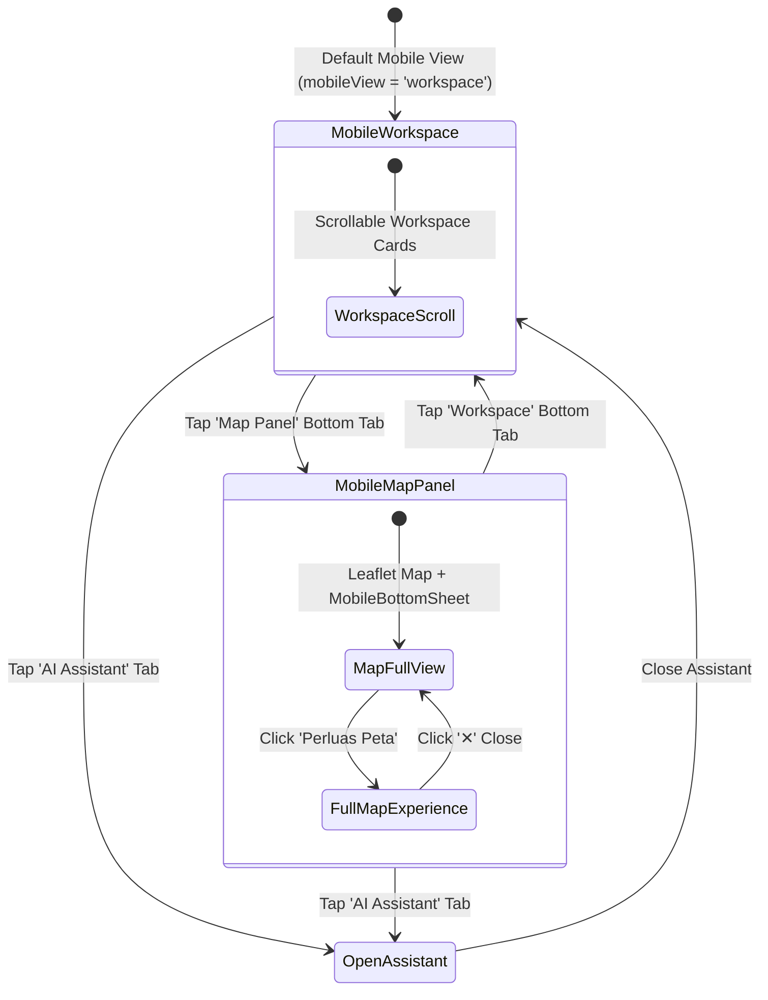

# PRD-07: Mobile Bottom Navigation Shell & View State Machine

## Metadata

| Field | Value |
|---|---|
| **Author** | Rumper Product Agent & Senior PM |
| **Status** | Approved / Active Production Specification |
| **Created** | 2026-08-22 |
| **Version** | 2.0 |
| **Target Path** | [`docs/prd/PRD-07-mobile-bottom-nav-shell.md`](file:///Users/arisandy/Downloads/Rumper%20App/rumper-web-gamification-main/docs/prd/PRD-07-mobile-bottom-nav-shell.md) |
| **Baseline Documents** | [`PRD-00-overview-architecture.md`](file:///Users/arisandy/Downloads/Rumper%20App/rumper-web-gamification-main/docs/prd/PRD-00-overview-architecture.md), [`PRD-01-app-header-navigation.md`](file:///Users/arisandy/Downloads/Rumper%20App/rumper-web-gamification-main/docs/prd/PRD-01-app-header-navigation.md) |
| **Owning Workstreams** | `Product_Management`, `Mobile_UX`, `Frontend_Engineering` |

---

## 1. Summary

The **Mobile Bottom Navigation Shell** governs the mobile-specific viewport architecture (`<1024px`). It manages top location bar state (`📍 Grand Galaxy City... Ganti`), bottom navigation bar rendering (`MobileBottomNav.tsx` with 4 menu items: Workspace, Map Panel, AI Assistant, Profile), viewport mode switching (`mobileView: 'workspace' | 'map-panel'`), and safe-area inset ergonomics.

---

## 2. Product Objective

- **Thumb-Zone Optimization**: Position primary navigation items within the natural bottom thumb reach zone.
- **Dual-View Mode Switching**: Enable 1-tap switching between full analytical reading (`workspace`) and spatial map investigation (`map-panel`).
- **Location Context Retention**: Keep active property address and quick `"Ganti"` location switcher accessible at the top of the mobile viewport.

---

## 3. User Outcome (Per-Menu Item Goals)

| Bottom Menu Item | Primary User Goal | Action & Target View |
|---|---|---|
| 🗂️ **Workspace** (`LayoutGrid`) | Access the complete 5-step risk report & checklists. | Switches `mobileView` to `'workspace'`. Hides full-bleed map; displays vertical workspace cards. |
| 🗺️ **Map Panel** (`Map`) | Inspect property location, flood hazards, transit routes, and POIs. | Switches `mobileView` to `'map-panel'`. Renders full Leaflet map with interactive bottom sheet. |
| 💬 **AI Assistant** (`MessageSquare`) | Ask spatial questions about property liveability. | Opens `AssistantDrawer` over mobile viewport. |
| 👤 **Profile** (`User`) | Manage saved properties, search quota, and account plan. | Opens Profile & Quota modal. |

---

## 4. Scope Boundaries

### In Scope
- **Fixed Bottom Nav Bar**: Fixed `60px` height with shadow `0 -4px 16px rgba(0, 30, 43, 0.08)`.
- **Top Mobile Location Bar**: White bar with pin icon, truncated address, and `"Ganti"` blue link.
- **Active State Highlights**: Dark teal `#0F2B38` icon + label for active tab; slate `#64748B` for inactive.
- **Safe Area Insets**: Padding support for iOS home indicator bar (`env(safe-area-inset-bottom)`).

### Out of Scope
- **Native iOS/Android App Shell**: Native mobile code (Swift/Kotlin); runs as responsive PWA/Web.

---

## 5. Functional Requirements

| FR-ID | Category | Requirement Description | Priority |
|---|---|---|---|
| **FR-701** | Bottom Nav Bar | Render fixed bottom bar with 4 menu items (`Workspace`, `Map Panel`, `AI Assistant`, `Profile`) for `<1024px` viewports. | Must Have |
| **FR-702** | View Toggling | Clicking `Workspace` sets `mobileView = 'workspace'`; clicking `Map Panel` sets `mobileView = 'map-panel'`. | Must Have |
| **FR-703** | Assistant Trigger| Clicking `AI Assistant` opens `AssistantDrawer` on mobile. | Must Have |
| **FR-704** | Location Bar | Render top sticky location bar with active property name and `"Ganti"` CTA opening `PropertyModal`. | Must Have |
| **FR-705** | Haptic Feedback | Apply tactile active press scaling (`active:scale-95`) on bottom nav tab tap. | Must Have |
| **FR-706** | Safe Area | Add padding-bottom `env(safe-area-inset-bottom)` to prevent iOS home bar overlap. | Must Have |

---

## 6. State Machine & View Transition Logic



---

## 7. Technical Specs & TypeScript Interfaces

```typescript
export type MobileTab = 'workspace' | 'map-panel' | 'ai-assistant' | 'profile'

export interface MobileBottomNavProps {
  activeTab: MobileTab
  onTabSelect: (tab: MobileTab) => void
}

export interface MobileTopLocationBarProps {
  activePropertyName: string
  activePropertySubdistrict: string
  onOpenLocationModal: () => void
}
```

---

## 8. Acceptance Criteria (Gherkin Scenarios)

### Scenario 1: Switching to Map Panel View
- **Given** user is viewing the mobile workspace report
- **When** the user taps the `"Map Panel"` tab in the bottom navigation
- **Then** the view transitions to `mobileView = 'map-panel'`, displaying the Leaflet map with the interactive `MobileBottomSheet`.

### Scenario 2: Opening Location Switcher
- **Given** user is on mobile viewport
- **When** the user taps `"Ganti"` on the top mobile location bar
- **Then** `PropertyModal` opens, allowing selection of another property from `propertiesList`.

---

## 9. Mobile UX Ergonomics & Touch Targets
- Bottom navigation buttons have minimum height `48px` and full-width division (25% viewport width per tab).
- Text labels use `11px` font size with bold weight on active state.
- Contrast ratio between `#64748B` (inactive) and white background is > 4.5:1.
