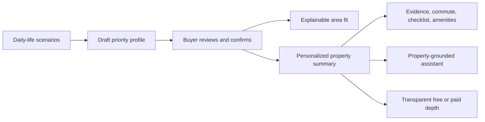

# PRD-11: Personalized Buyer Decision Journey

## Metadata

| Field | Value |
|---|---|
| **Author** | Rumper Product Agent & Senior PM |
| **Status** | Proposed — Next Improvement |
| **Created** | 2026-08-22 |
| **Version** | 1.0 |
| **Target Path** | `docs/prd/PRD-11-personalized-buyer-decision-journey.md` |
| **Baseline Documents** | `PRODUCT.md`, `PRD-00`, `PRD-02`, `PRD-04`, `PRD-05`, `PRD-06` |
| **Owning Workstreams** | Product, UX Research, Frontend, Data/Scoring, AI, Growth |

---

## 1. Executive Summary

Rumper currently has two partially connected experiences:

1. `Setup Gravitasi`, an onboarding wizard that collects household, work, location-anchor, budget, and preferred-corridor inputs.
2. The five-step property due-diligence workspace: `Ringkasan`, `Faktor Risiko`, `Perjalanan`, `Checklist`, and `Fasilitas`.

The current wizard does not yet create a durable buyer profile. Its data is held in component-local state and discarded when the wizard closes. The property workspace therefore evaluates every property with largely the same factor ordering and language, regardless of what the buyer selected.

This improvement turns the wizard into a **scenario-led Buyer Priority Discovery module** and introduces a persistent **Buyer Priority Profile**. That profile will explain what Rumper inferred, support explainable area recommendations, personalize property evaluations, ground the property assistant, and make free-versus-paid access clearer.

The feature must preserve one safety rule: personalization can change emphasis, ordering, and explanation, but it must never hide or reduce the severity of critical safety red flags.

---

## 2. Problem Statement

### Current user problem

Buyers often do not know how to translate daily-life constraints into useful property criteria. Conventional preference forms ask them to declare priorities before they understand the tradeoffs. After choosing a property, the current workspace gives useful location evidence, but it does not explain the property through the buyer's own confirmed priorities.

### Current product limitations

| Existing capability | Current state | Limitation addressed by this PRD |
|---|---|---|
| `Setup Gravitasi` wizard | Collects direct form inputs and includes marketing/validation stages | Does not use realistic decisions to infer priorities; no persistent output |
| Wizard store | Local React state with default values | Resets on remount and is not passed to `App` on completion |
| Corridor preview | Shows illustrative corridor cards and scores | Not computed from the buyer profile; lacks tradeoffs and unknowns |
| Property summary | Shows score, verdict, risk summary, and sources | Not personalized and does not explain priority fit |
| Risk/checklist modules | Show predefined risk and task priorities | Priorities do not change based on confirmed buyer dealbreakers |
| AI assistant | Evidence-linked prototype UI | Submitted questions do not receive grounded responses; active property context is partly hard-coded |
| Entitlements | Free badge, quota, locks, banner, and upgrade drawer | Full free/paid comparison and per-property payment scope are fragmented |

### Product opportunity

Connect discovery and due diligence into one explainable decision journey:



---

## 3. Objectives and Non-Objectives

### Objectives

- Help buyers discover priorities through realistic choices rather than a conventional preference questionnaire.
- Explain every inferred priority using plain language, its originating choices, and an explicit confidence level.
- Let buyers confirm, edit, remove, or mark a priority as a dealbreaker before it affects results.
- Carry the confirmed profile into area and property evaluation automatically.
- Explain recommendations through **fit**, **tradeoffs**, and **unknowns**, not only scores or rankings.
- Ground assistant answers in the active property, buyer priorities, and available evidence.
- Clarify free and paid access before the user encounters a lock.

### Non-objectives for the first release

- Replacing deterministic hazard scoring with AI-generated scoring.
- Guaranteeing that an area or property is suitable, safe, or financially advisable.
- Hiding statutory or critical red flags because a buyer did not select them as a priority.
- Building live nationwide inventory search before data coverage and recommendation quality are validated.
- Using inferred sensitive traits or protected characteristics for ranking.

---

## 4. Product Principles and Guardrails

1. **Confirmed, not assumed:** inferred priorities remain drafts until the buyer confirms them.
2. **Reason before score:** show the reason, tradeoff, and evidence before emphasizing a numerical fit score.
3. **Unknown is a valid result:** absent or stale data must appear as unknown, not neutral or safe.
4. **Safety is non-negotiable:** critical hazard severity is determined independently of preference weights.
5. **Personalization is inspectable:** the buyer can see and edit the profile affecting results.
6. **AI does not own truth:** the assistant summarizes retrieved evidence and must cite or qualify its claims.
7. **No dark-pattern gating:** communicate the entitlement boundary, price scope, and locked value before purchase.

---

## 5. Target Users and Jobs

### Primary persona

An Indonesian first-home buyer or household comparing Jabodetabek areas and properties while balancing commute, budget, environmental risk, facilities, and daily-life needs.

### Core jobs

- “Help me understand which compromises I am actually willing to make.”
- “Show me why an area or property fits my life.”
- “Tell me what I give up and what information is still missing.”
- “Carry my dealbreakers forward so I do not repeat myself.”
- “Let me verify the conclusion instead of asking me to trust a score.”

---

## 6. Approved User Stories

### Epic A — Buyer Priority Discovery

**US-1101 — Scenario discovery**  
As a buyer who has not yet defined my search criteria, I want to respond to realistic housing scenarios, so I can discover my priorities without completing a conventional preference questionnaire.

**US-1102 — Priority transparency**  
As a buyer, I want to see which priorities Rumper inferred, which choices influenced each inference, and how confident the system is, so I can correct the profile before it affects recommendations.

### Epic B — Explainable Fit and Continuity

**US-1103 — Explainable area recommendations**  
As a buyer comparing areas, I want each recommendation to show why it fits my priorities, its material tradeoffs, and important missing information, so I can make my own judgment rather than relying on a ranking.

**US-1104 — Priority continuity**  
As a buyer opening a property evaluation, I want my confirmed priorities applied automatically to the summary, risk ordering, and visit checklist, while critical safety warnings remain visible regardless of my preferences.

### Epic C — Trusted Decision Workspace

**US-1105 — Progressive property evaluation**  
As a buyer opening a property, I want an immediate decision-oriented summary and clear paths into evidence, commute, site checks, and nearby facilities, so I can understand the key concerns first and investigate further when needed.

**US-1106 — Grounded property assistant**  
As a buyer evaluating a property, I want the assistant to answer using that property's available evidence, cite the supporting information, and state when information is missing, so I do not mistake assumptions for verified facts.

**US-1107 — Transparent entitlements**  
As a free-plan buyer, I want a clear comparison of free and paid capabilities—including price, duration, and whether access applies per property—before I encounter a locked feature.

---

## 7. Integration with Existing Modules

### Architecture decision

Do **not** add a sixth due-diligence tab. Priority discovery belongs upstream in the existing `Setup Gravitasi` wizard, while profile controls remain accessible from the header/profile area. The five workspace tabs remain focused on evaluating a selected property.

| Existing module | Required improvement | Data consumed or produced |
|---|---|---|
| `ResponsiveWizardShell` | Replace the promotional/validation sequence with scenario decisions, priority explanation, confirmation, and existing practical constraints | Produces confirmed `BuyerPriorityProfile` |
| `useWizardStore` | Lift state to app-level store; add persistence, schema version, timestamps, reset/edit actions | Owns draft and confirmed profile |
| `AppHeader` | Rename `Setup Gravitasi` to `Prioritas Saya`; show incomplete/confirmed state | Opens profile discovery or edit flow |
| `CuratedAreasMapScreen` / `AreaRecommendationsWorkspace` | Display area cards with fit reasons, tradeoffs, and unknowns; provide direct re-calibration touchpoints (header 'Ubah Prioritas' and interactive anchor pin) without quota penalty | Consumes profile plus area evidence; triggers re-calibration |
| `ScoreCard` | Add `Yang cocok untuk Anda`, `Tradeoff utama`, and `Belum diketahui`; retain absolute risk verdict | Consumes property evaluation plus profile |
| `FactorRisksCard` | Reorder non-critical factors by personal relevance; explain why a factor is emphasized | Consumes profile weights and dealbreakers |
| `DeepDiveEvidenceWorkspace` | Highlight evidence linked to personal dealbreakers and preserve evidence confidence | Consumes profile and evidence records |
| `CommuteWorkspace` | Default to confirmed anchors and work pattern; distinguish typical, peak, and unknown travel times | Consumes anchors and work pattern |
| `ChecklistWorkspace` | Generate or reprioritize tasks from dealbreakers and evidence gaps | Consumes profile and property gaps |
| `FasilitasWorkspace` | Default filters and ordering from relevant priorities without hiding other categories | Consumes profile relevance |
| `AssistantDrawer` | Receive property ID, profile, evidence bundle, and entitlement context; return cited or qualified responses | Consumes grounded context; produces messages/actions |
| `UpgradeDrawer` and `UpgradeBanner` | Add explicit free/paid comparison and state that payment applies once per location if that remains the approved model | Consumes entitlement definition |

### Existing flow to preserve

The current `Ringkasan → Faktor Risiko → Perjalanan → Checklist → Fasilitas` progression remains intact. Personalization enriches each stage; it does not replace the due-diligence structure.

---

## 8. Functional Requirements

### 8.1 Priority discovery and profile

| ID | Requirement | Priority |
|---|---|---|
| **FR-1101** | Present 5–7 realistic decision scenarios containing meaningful tradeoffs across commute, hazard exposure, budget, space, facilities, and neighborhood conditions | Must |
| **FR-1102** | Each scenario response updates one or more draft priority signals using a deterministic, versioned mapping | Must |
| **FR-1103** | Show a draft priority profile with plain-language reasoning and the scenario choices that contributed to each priority | Must |
| **FR-1104** | Show confidence as `Kuat`, `Sedang`, or `Tentatif`; confidence must represent evidence from user choices, not predictive certainty | Must |
| **FR-1105** | Allow the buyer to confirm, edit weight, remove, or mark a priority as a dealbreaker | Must |
| **FR-1106** | Retain existing household, work pattern, anchors, budget, and corridor inputs as practical constraints after scenario discovery | Must |
| **FR-1107** | Persist the profile with a schema version and `updatedAt`; support reset and re-run | Must |
| **FR-1108** | Never infer sensitive attributes or use them as hidden ranking inputs | Must |

### 8.2 Explainable recommendations

| ID | Requirement | Priority |
|---|---|---|
| **FR-1110** | Each area recommendation displays 2–3 priority-fit reasons | Must |
| **FR-1111** | Each recommendation displays at least one material tradeoff when known | Must |
| **FR-1112** | Each recommendation displays missing, stale, or unavailable data as explicit unknowns | Must |
| **FR-1113** | If a fit score is shown, provide a `Mengapa?` explanation of the deterministic inputs | Must |
| **FR-1114** | Allow users to compare at least two areas using the same confirmed priorities | Should |
| **FR-1115** | Do not label an area “recommended” when it violates a confirmed dealbreaker unless the conflict is prominently disclosed | Must |

### 8.3 Personalized property workspace

| ID | Requirement | Priority |
|---|---|---|
| **FR-1120** | On property open, show a personalized summary without delaying the existing immediate risk summary | Must |
| **FR-1121** | Separate `Cocok untuk Anda`, `Tradeoff`, `Red flag`, and `Belum diketahui` into distinct content groups | Must |
| **FR-1122** | Raise visual urgency for evidence-backed conflicts with dealbreakers | Must |
| **FR-1123** | Critical red flags remain visible and retain their absolute severity regardless of profile weights | Must |
| **FR-1124** | Default commute destinations to confirmed daily anchors | Must |
| **FR-1125** | Add property-specific, priority-linked evidence gaps to the field checklist | Should |
| **FR-1126** | When no confirmed profile exists, use the current generic workspace and invite the user to define priorities without blocking evaluation | Must |

### 8.4 Grounded assistant

| ID | Requirement | Priority |
|---|---|---|
| **FR-1130** | Pass active property ID/name, confirmed profile, score inputs, evidence records, gaps, commute data, and facilities into the assistant context | Must |
| **FR-1131** | Every material factual response includes one or more visible evidence references or says that supporting data is unavailable | Must |
| **FR-1132** | The assistant distinguishes verified fact, deterministic inference, buyer preference, and unknown | Must |
| **FR-1133** | The assistant must not invent evidence, change scores, or claim that missing data is safe | Must |
| **FR-1134** | Suggested actions can add an evidence gap or question to the existing visit checklist | Should |
| **FR-1135** | Switching the active property starts a new property context or clearly warns before retaining the old conversation | Must |

### 8.5 Entitlement transparency

| ID | Requirement | Priority |
|---|---|---|
| **FR-1140** | Show an accessible free-versus-paid comparison from the plan badge and every locked-feature entry point | Must |
| **FR-1141** | State price, billing type, access duration, location scope, quota effect, and refund/support route before confirmation | Must |
| **FR-1142** | Keep critical red flags and the basic property summary free | Must |
| **FR-1143** | Locked previews describe the additional decision value, not merely the feature name | Should |

---

## 9. Data Contracts

The data model should remain deterministic and inspectable.

```typescript
type PriorityKey =
  | "flood_safety"
  | "commute_reliability"
  | "budget_discipline"
  | "quiet_environment"
  | "school_access"
  | "healthcare_access"
  | "daily_amenities"
  | "future_space"

interface PriorityReason {
  scenarioId: string
  optionId: string
  explanation: string
}

interface BuyerPriority {
  key: PriorityKey
  weight: 1 | 2 | 3 | 4 | 5
  dealbreaker: boolean
  confidence: "tentative" | "medium" | "strong"
  reasons: PriorityReason[]
  confirmedByUser: boolean
}

interface BuyerPriorityProfile {
  id: string
  schemaVersion: 1
  status: "draft" | "confirmed"
  householdType: "single" | "pasangan" | "keluarga-muda"
  workPattern: "wfo" | "hybrid" | "remote"
  anchors: Array<{ label: string; type: "primary" | "secondary" }>
  budget: { minMillions: number; maxMillions: number }
  preferredCorridors: string[]
  priorities: BuyerPriority[]
  updatedAt: string
}

interface FitExplanation {
  profileVersion: number
  fits: Array<{ priorityKey: PriorityKey; explanation: string; evidenceIds: string[] }>
  tradeoffs: Array<{ priorityKey: PriorityKey; explanation: string; evidenceIds: string[] }>
  unknowns: Array<{ field: string; explanation: string; suggestedAction?: string }>
  criticalRedFlags: Array<{ riskId: string; severity: "high" | "critical"; evidenceIds: string[] }>
}
```

### Scoring boundary

- Hazard severity comes from the existing deterministic property-risk model.
- Personal relevance may affect ordering, emphasis, and fit calculations.
- Personal relevance must not modify source evidence, confidence, or absolute hazard severity.
- Recommendation explanations must store the profile version used, so a result can be reproduced after the buyer edits priorities.

---

## 10. Scenario Design Requirements

A scenario must force a plausible compromise. It must not ask the buyer to choose between an obviously good and obviously bad option.

Example:

> Two properties are within budget. Property A has a 35-minute commute but moderate flood exposure. Property B has a 55-minute commute and lower flood exposure. Which would you investigate first?

Each option must define:

- the priority signals affected;
- positive and negative weight adjustments;
- why that mapping is reasonable;
- whether another scenario is required before confidence can increase;
- neutral “it depends” or “I need more information” handling.

Scenario mappings require product and UX approval and must be version-controlled. They must not be generated dynamically by the assistant in the first release.

---

## 10.1 UI/UX Interaction & Design Engineering Specifications

To ensure the discovery wizard delivers exceptional perceived craft, intuitive mobile ergonomics, and strict accessibility, the following design engineering standards are mandatory:

### A. Stage 1 Friction Discovery & Cognitive Chunking
- **Thematic Chunking ($\le 4$ Rule):** To prevent cognitive entry fatigue, friction choices must be grouped into **3 core thematic categories** plus an expandable trigger:
  1. 🚆 **Akses & Komuter:** *Klaim komut brosur vs jalan macet riil*.
  2. 🌊 **Banjir & Lingkungan:** *Genangan air, elevasi tanah, & IPL pompa*.
  3. 💰 **Budget & Legalitas:** *Takut boncos cicilan KPR & biaya tak terduga*.
  4. ➕ **Pertimbangan Lainnya:** *Kekhawatiran spesifik lainnya*.
- **Tactile Interaction:** Option cards must feature subtle tactile press states (`active:scale-[0.98] transition-transform duration-150`) with instant checkmark badge feedback.

### B. Mobile Swipe Deck Interaction & Physics Guardrails
- **Scroll & Gesture Collision Prevention:** Deprecate the vertical swipe-down decision trigger (`onSelectChoice("neither")`). Vertical drag gestures must yield to native document scrolling.
- **Horizontal Axis Lock:** Card swipe physics must activate only when displacement is predominantly horizontal ($|\Delta X| > |\Delta Y| \times 1.5$ and $|\Delta X| > 10\text{px}$).
- **Accessible Moderate Choice:** The "Moderat" compromise choice must be selectable with $100\%$ clarity via the sticky bottom thumb button bar.
- **Micro-Physics:** Card rotation is clamped between $[-14^\circ, +14^\circ]$ with stamp opacity proportional to horizontal delta ($|\Delta X| / 60$).

### C. Step 3 Budget Range & Dynamic KPR Financial Telemetry
- **Cashflow Translation Telemetry:** Supplement total property price with an inline estimated monthly KPR installment telemetry badge:
  $$\text{Cicilan/bln} \approx \frac{\text{Harga Properti} \times 0.90 \times (1 + 0.07 \times 20)}{20 \times 12}$$
  Example output: `Est. Cicilan KPR: ~Rp 5.8 Jt – 8.7 Jt/bln (Asumsi DP 10%, 20 Thn)`.
- **Layout Stability:** All monetary numbers and duration values must use `tabular-nums font-mono` to eliminate horizontal text jitter when dragging range sliders.
- **Screen Reader Accessibility (WCAG 2.2 AA):** Range sliders must provide `aria-label`, `aria-valuemin`, `aria-valuemax`, `aria-valuenow`, and formatted `aria-valuetext` (e.g. `"Rp 800 Juta"`).

### D. Step 1 Household & Work Progressive Disclosure
- **Sequential Auto-Focus:** Selecting an option in Section A (Tipe Rumah Tangga) triggers a smooth auto-scroll/focus transition to Section B (Pola Kerja) to guide the dual-decision screen without cognitive overload.

### E. Design System & Typography Tokens
- **Type Ramp Normalization:** Micro-badges and telemetry tags must use `text-[10px]` (`text-xs font-bold leading-none`), complying with Rumper's `DESIGN.md` type ramp.
- **Touch Target Minimum:** All interactive buttons and preset pills must maintain $\ge 44\times 44\text{px}$ minimum hit areas.
- **Text Wrapping:** Headings use `text-wrap: balance` to prevent awkward lines; body copy uses `text-wrap: pretty` to eliminate orphan words.
- **Transition Specificity:** Replace generic `transition-all` with explicit CSS transition properties (`transition-[transform,opacity,border-color,background-color]`).

---

## 11. Release Strategy and Prioritization

### Recommended sequence

| Increment | Scope | Dependency | Release gate |
|---|---|---|---|
| **I1 — Profile foundation** | Persistent profile store, scenario mapping, priority explanation, confirmation/editing, existing constraints | UX validation of scenarios and mapping | Buyers can complete, inspect, edit, close, and recover a profile |
| **I2 — Property continuity** | Personalized summary, risk emphasis, anchor-aware commute, checklist priority | I1 plus normalized property/evidence IDs | Safety invariants pass; generic fallback works without a profile |
| **I3 — Trust layer** | Grounded assistant contract and transparent entitlement comparison | Reliable evidence bundle and approved commercial terms | No uncited material claims in test set; price scope is unambiguous |
| **I4 — Area recommendations** | Area fit cards, tradeoffs, unknowns, comparison | Sufficient structured area inventory and evidence coverage | Recommendation quality and unknown handling pass moderated testing |

### Prioritization rationale

Use WSJF once the team supplies cost-of-delay and job-size estimates. Until then, a qualitative sequencing assessment gives this order:

1. **Profile foundation** — highest dependency leverage; all personalization relies on it.
2. **Property continuity** — reuses the strongest existing workspace and creates earlier user value than a new search surface.
3. **Trust layer** — important, but grounded answers depend on normalized context and evidence.
4. **Area recommendations** — strategically valuable but highest data-quality and recommendation-risk exposure.

Do not present invented WSJF precision without actual reach, cost-of-delay, and effort data.

---

## 12. Success Metrics

Final targets require baseline measurement. The metrics below define what must be instrumented before setting numeric commitments.

### Discovery funnel

- Scenario flow start rate
- Scenario flow completion rate
- Median completion time
- Priority confirmation rate
- Percentage of profiles edited before confirmation
- Profile return/edit rate

### Decision quality and trust

- Percentage of users opening `Mengapa`, evidence, tradeoff, or unknown details
- Percentage of property evaluations using a confirmed profile
- Checklist additions originating from personalized gaps
- Assistant grounded-answer success rate on a reviewed test set
- Unsupported-claim rate; target must be zero for release-blocking critical claims
- User-reported understanding of “why this fits me” in moderated research

### Commercial clarity

- Free/paid comparison view rate before paywall interaction
- Upgrade conversion after comparison view
- Upgrade cancellation attributed to unclear price/scope
- Support questions about subscription versus per-location payment

### Guardrail metrics

- Critical red-flag suppression incidents: zero
- Unknown data incorrectly rendered as safe: zero
- Cross-property assistant context leakage: zero
- Profile persistence or schema-migration data loss incidents

---

## 13. Analytics Events

Minimum events:

- `priority_discovery_started`
- `priority_scenario_answered` with scenario and option IDs, excluding free-text personal data
- `priority_profile_generated`
- `priority_profile_edited`
- `priority_profile_confirmed`
- `area_fit_explanation_opened`
- `property_personalized_summary_viewed`
- `tradeoff_opened`
- `unknown_opened`
- `assistant_question_submitted`
- `assistant_evidence_opened`
- `entitlement_comparison_viewed`
- `upgrade_started`
- `upgrade_completed`

Analytics must not store sensitive free-text assistant messages by default without an approved privacy policy.

---

## 14. Acceptance Criteria

### AC-01 — Scenario-led discovery

- Given a buyer starts `Prioritas Saya`, when they answer the required scenarios, then Rumper produces a draft profile without requiring them to directly rank a long list of preferences.

### AC-02 — Explainable inference

- Given a draft priority, when the buyer opens its explanation, then they see the choices that influenced it, a plain-language reason, and a confidence label.

### AC-03 — Buyer control

- Given a draft profile, when the buyer edits, removes, or marks a priority as a dealbreaker and confirms, then the confirmed profile reflects those changes and persists after closing and reopening the app.

### AC-04 — Safe personalization

- Given flood safety is not a selected priority, when a property has a critical flood red flag, then the red flag remains prominently visible with unchanged severity.

### AC-05 — Property continuity

- Given a confirmed commute-reliability priority and daily anchor, when the buyer opens a property, then the summary explains relevant commute fit and the commute workspace defaults to that anchor.

### AC-06 — Explainable recommendation

- Given sufficient area data, when an area recommendation is shown, then it contains at least one fit reason, one tradeoff when known, and every material missing field under unknowns.

### AC-07 — Grounded assistant

- Given a buyer asks about flood risk, when relevant evidence exists, then the response links to that evidence; when it does not exist, the response explicitly states that the information is unavailable and suggests a verification action.

### AC-08 — Context isolation

- Given the buyer switches properties, when the assistant is opened, then it cannot silently answer using the previous property's evidence.

### AC-09 — Transparent access

- Given a free user opens the plan comparison, then they can identify what is free, what is paid, the price, billing type, duration, and location scope without first clicking a locked tab.

### AC-10 — No-profile fallback

- Given no profile has been confirmed, when a property is opened, then the current generic risk workspace remains usable and does not fabricate personalization.

---

## 15. Risks and Mitigations

Risk scoring uses probability × impact on a 1–5 scale. These are planning estimates and require review after user research and technical discovery.

| Risk | P | I | Score | Response | Mitigation |
|---|---:|---:|---:|---|---|
| Scenarios produce shallow or biased priority inferences | 4 | 5 | 20 | Avoid/Mitigate | Moderated research; deterministic mappings; buyer confirmation; versioning |
| Personalization hides safety concerns | 2 | 5 | 10 | Mitigate | Separate absolute risk severity from relevance; invariant tests |
| Area recommendations overstate weak data | 4 | 5 | 20 | Avoid/Mitigate | Delay I4 until coverage thresholds exist; explicit unknowns; no recommendation on dealbreaker conflicts |
| Assistant fabricates or uses stale context | 3 | 5 | 15 | Mitigate | Retrieval allowlist, citations, property-context isolation, reviewed evaluation set |
| Wizard abandonment increases because the flow is too long | 4 | 3 | 12 | Mitigate | Progressive scenarios, save/resume, optional refinement, instrumentation |
| Profile state is lost or incompatible after schema changes | 3 | 4 | 12 | Mitigate | Versioned schema, migration tests, reset/recovery path |
| Commercial terms remain ambiguous | 3 | 4 | 12 | Mitigate | Single source of entitlement truth; legal/growth copy approval |

---

## 16. Dependencies and Decision Gates

### Required dependencies

- UX research validating scenario comprehension and tradeoff realism.
- Product-approved scenario-to-priority mappings.
- Stable identifiers for properties, evidence, risks, checklist items, and area records.
- Decision on persistence scope: local prototype, authenticated account, or backend profile.
- Evidence retrieval contract for the assistant.
- Approved commercial definition for price, duration, refund, quota, and per-location scope.

### Decisions required before implementation

1. Is `Setup Gravitasi` mandatory for new users, optional, or progressively prompted?
2. Does a confirmed profile belong to an individual account or a shared household?
3. Which priority taxonomy is supported in V1?
4. What minimum evidence coverage permits an area to be recommended?
5. Is Premium access still a one-time payment per location? This needs business verification before UI copy is finalized.
6. Which data can the assistant retrieve, and what freshness metadata is available?

---

## 17. Test and Release Gates

The feature is not release-ready until:

- scenario mappings pass product and UX review;
- profile persistence and schema migration tests pass;
- critical-red-flag invariant tests pass across every profile combination;
- no-profile generic fallback is verified;
- assistant evaluation contains no fabricated citations or cross-property context leakage;
- entitlement copy matches approved commercial terms;
- mobile and desktop flows support keyboard, touch, screen-reader labels, and reduced motion;
- analytics events are validated without collecting unnecessary personal data.

---

## 18. Ownership and RACI

| Work item | Product | UX Research/Design | Frontend | Data/Scoring | AI | Growth/Commercial |
|---|---|---|---|---|---|---|
| Priority taxonomy and scenario mappings | A | R | C | C | I | I |
| Wizard and profile experience | A | R | R | C | I | I |
| Profile persistence and integration | A | C | R | R | I | I |
| Safety scoring boundary | A | C | C | R | I | I |
| Area recommendation explanation | A | R | R | R | C | I |
| Grounded assistant | A | C | C | C | R | I |
| Entitlement definition and copy | C | C | R | I | I | A/R |
| Release quality gate | A | C | R | R | R | C |

`A` = Accountable, `R` = Responsible, `C` = Consulted, `I` = Informed.

---

## 19. Definition of Done

PRD-11 is complete when a buyer can:

1. make realistic scenario decisions;
2. inspect and confirm the resulting priority profile;
3. return later without losing it;
4. see that profile explain an area's or property's fit, tradeoffs, and unknowns;
5. investigate evidence through the existing five-step workspace;
6. ask a property-grounded assistant that cites evidence or admits missing data; and
7. understand the free/paid boundary before purchasing.

Implementation should proceed incrementally through I1–I4 rather than as a single big-bang release.
