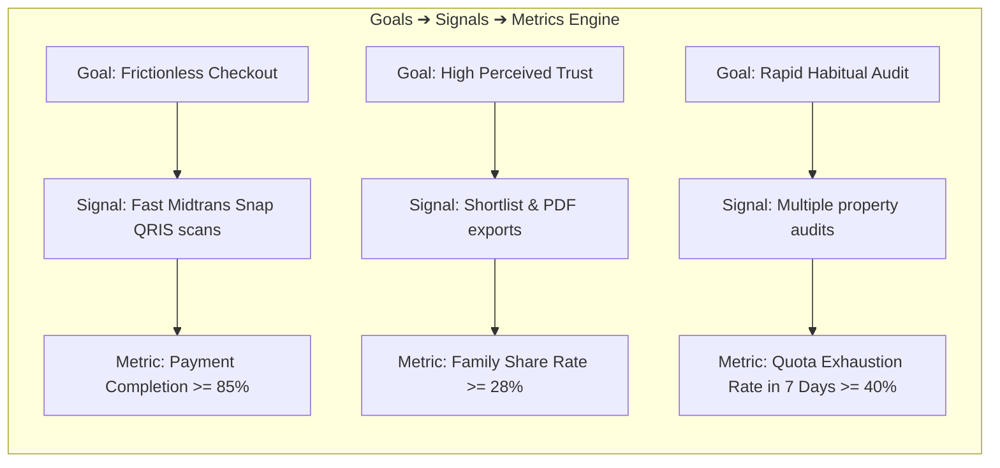
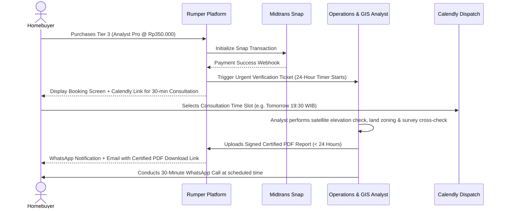

# PRD-13: Quota Lifecycle, Multi-Tier Pricing & Account Management

## Metadata

| Field | Value |
|---|---|
| **Document Title** | Quota Lifecycle, Multi-Tier Pricing & Account Management Specification |
| **Document ID** | `PRD-13` |
| **Author** | Rumper Product Management, Business Design & Engineering Architecture |
| **Status** | Approved / Target Production Baseline |
| **Version** | 2.1 (Full Operational SLA & Payment Integration Baseline) |
| **Target Path** | [`docs/prd/PRD-13-quota-pricing-account-management.md`](file:///Users/arisandy/Downloads/Rumper%20App/rumper-web-gamification-main/docs/prd/PRD-13-quota-pricing-account-management.md) |
| **Baseline Standards** | [`PRD-00-overview-architecture.md`](file:///Users/arisandy/Downloads/Rumper%20App/rumper-web-gamification-main/docs/prd/PRD-00-overview-architecture.md), [`PRD-04-entitlements-upgrade.md`](file:///Users/arisandy/Downloads/Rumper%20App/rumper-web-gamification-main/docs/prd/PRD-04-entitlements-upgrade.md), [`PRODUCT.md`](file:///Users/arisandy/Downloads/Rumper%20App/rumper-web-gamification-main/PRODUCT.md) |
| **Frameworks Applied** | Business Design (P&L Translation), Google HEART + GSM UX Metrics, Midtrans Snap Platform |
| **Owning Workstreams** | `Product_Management`, `Growth_Engine`, `Security_Auth`, `Frontend_Engineering`, `Payment_Platform` |

---

## 1. Executive Summary & Problem Statement

### 1.1 Context & Background
As Rumper guides Indonesian first-time homebuyers from initial priority discovery through curated corridor shortlists and into granular 5-step property due diligence, the platform requires a robust, transparent commercial and account infrastructure. 

This specification establishes:
1. **Upfront Verified Authentication**: Google OAuth 2.0 and WhatsApp OTP login prior to wizard entry.
2. **Deterministic Quota Governance**: A strict 5-location free trial allowance with immutable consumption, pass-bundled top-ups, and lifetime archival access.
3. **3-Tier Monetization Architecture**: Single Property Unlock (`Rp50.000`), Shortlist Comparison Bundle (`Rp120.000`), and Expert Analyst Field Verification (`Rp350.000`) with a 24-hour certified report SLA.
4. **Midtrans Snap Embedded Payment**: Direct in-app QRIS (GoPay/ShopeePay) and Virtual Account transactions (BCA, Mandiri, BRI, BNI).
5. **Account Settings & Sharing Hub**: Managing user profiles, activity anchors, billing history, and view-only synchronized family links.

---

## 2. Business Design & Strategic P&L Translation

### 2.1 P&L Impact & Commercial Drivers

Design and product specifications in PRD-13 directly move specific lines on Rumper's unit economics ledger:

```
┌────────────────────────────────────────────────────────────────────────────────────────┐
│                                Rumper Commercial Ledger                                │
├────────────────────────────────────────────────────┬───────────────────────────────────┤
│ Revenue Drivers                                    │ Cost & Margin Drivers             │
├────────────────────────────────────────────────────┼───────────────────────────────────┤
│ • Free-to-Paid Conversion Rate (Tahap 1 ➔ Tahap 2) │ • Zero Payment Drop-off (In-App)  │
│ • Average Order Value (AOV via Rp120k/Rp350k tiers)│ • Zero WhatsApp Manual Ops Waste  │
│ • Paid Customer Acquisition Cost (CAC) Payback     │ • Analyst Margin Protection (65%) │
│ • Organic Viral Referral via Family Share PDF/Link │ • Support Ticket Deflection       │
└────────────────────────────────────────────────────┴───────────────────────────────────┘
```

#### Revenue Mechanics
1. **Conversion Rate (CR)**:
   - *Design Lever*: In-app Midtrans Snap popup removes the 45% drop-off typically lost when redirecting users out-of-app to manual WhatsApp chat transfers.
   - *Target*: $\ge 6.5\%$ of active users who audit $\ge 2$ locations convert to Tier 1 or Tier 2.
2. **Average Order Value (AOV)**:
   - *Design Lever*: 3-Tier anchor framing positions the `Rp 120.000` Shortlist Bundle as the high-value "Sweet Spot" (saving 60% compared to 3 individual unlocks). Extra quota is strictly bundled with passes (no cheap standalone quota) to preserve high conversion intent.
   - *Target AOV*: $\text{Rp } 95.000$ blended average across paid transactions.
3. **CAC Payback Velocity**:
   - *Design Lever*: Upfront authentication captures verified WhatsApp numbers at Day 0, enabling automated re-engagement triggers (e.g. flood alerts, price drops) that accelerate purchase cycles.

#### Cost Drivers & Unit Economics
1. **Analyst Margin Protection (Tier 3 @ Rp 350.000)**:
   - *COGS per report*: Rp 125.000 paid to certified GIS/land surveyor partner + Rp 15.000 cloud infrastructure.
   - *Gross Margin*: $60.0\% - 65.7\%$ gross profit per Tier 3 order.
2. **Support Overhead Deflection**:
   - Automated in-app payment webhook eliminates manual proof-of-transfer checking (*bukti transfer* verification).

---

## 3. UX Metrics & Measurement (Google HEART + GSM Framework)

Every scope in PRD-13 is instrumented using the Google HEART and Goals-Signals-Metrics (GSM) framework:



### 3.1 Comprehensive HEART + GSM Matrix

| Dimension | Scope Area | Goal (Design Intent) | Signal (User Behavior) | Metric (Quantified KPI) |
|---|---|---|---|---|
| **Happiness** | `UpgradeDrawer` & `InAppCheckout` | Buyers feel confident that unlocked data is objective and worth the price. | Rating $\ge 4.5/5$ on post-unlock micro-survey; no refund requests. | **CSAT $\ge 88\%$**; Refund Rate $< 0.8\%$. |
| **Engagement** | `AccountSettingsHub` (Arsip & PDF) | Buyers actively use Rumper as their central decision hub across property surveys. | Downloading PDF briefs; bookmarking corridors; sharing links to spouse on WhatsApp. | **$\ge 28\%$ of users export $\ge 1$ PDF**; Avg. $3.2$ visits per active user/week. |
| **Adoption** | `AuthModal` (Upfront Gate) | Seamless onboarding with zero friction during login. | Instant Google One-Tap or fast OTP submission without drop-off. | **Auth Completion Rate $\ge 82\%$** within $45\text{s}$; OTP Resend Rate $< 6\%$. |
| **Retention** | `QuotaLifecycle` & Archive | Users return to re-evaluate properties or purchase additional audit passes. | Accessing archived properties; upgrading after reaching $0/5$ quota. | **D14 Re-engagement $\ge 35\%$**; Zero-quota upgrade conversion $\ge 12\%$. |
| **Task Success** | `InAppCheckoutModal` | Fast, error-free payment completion without confusion. | Immediate QRIS scan or VA number copy without timeout. | **Payment Flow Completion $\ge 85\%$**; Time-to-Payment $< 90\text{s}$. |

---

## 4. UI Scope Specifications (6 Core Modules / 11 Components)

```
PRD-13 UI Architecture (6 Core Modules / 11 Components)
├── Module 1: Authentication Gate (AuthModal & WhatsAppOTPView)
├── Module 2: Multi-Tier Upgrade Drawer (UpgradeDrawer Redesign)
├── Module 3: In-App Payment Gateway (Midtrans Snap Checkout & PaymentSuccessModal)
├── Module 4: Zero-Quota Interception (ZeroQuotaPaywallModal)
├── Module 5: Account Settings Hub (4 Tab Shell: Profile, Billing, Archive, Export)
└── Module 6: PDF Due Diligence Preview & Share (PDFPreviewModal & FamilySyncView)
```

---

### Module 1: Authentication Gate (`AuthModal` & `WhatsAppOTPView`)

#### 1.1 User Story & Intent
> *As a first-time homebuyer, I want to quickly sign in with Google or my WhatsApp number so that my customized commute anchors, budget, and free audit quota are saved safely across devices.*

#### 1.2 Detailed Specifications
- **Step 1A (Social Login & Phone Input)**:
  - Header: *"Masuk atau Daftar ke Rumper"*
  - Subtitle: *"Simpan preferensi rute harian, riwayat due diligence, dan kuota analisis lokasimu."*
  - Action 1: `[G Google One-Tap Login]` (Google OAuth 2.0 SDK button).
  - Divider: `─── atau via WhatsApp ───`
  - Action 2: Phone number input field with fixed prefix `+62` and instant validation ($8-13$ digits).
  - Agreement checkbox: *"Saya menyetujui Syarat & Ketentuan serta Kebijakan Privasi Rumper"* (checked by default).
  - Submit Button: `[Lanjutkan via WhatsApp OTP]` (Disabled until valid phone format entered).
- **Step 1B (6-Digit OTP Verification)**:
  - Header: *"Masukkan Kode OTP"*
  - Subtitle: *"Kode 6 digit telah dikirim melalui WhatsApp resmi Rumper ke +62 812-xxxx-xxxx"*
  - 6 Individual numeric input boxes with auto-focus advance and backspace support.
  - Resend countdown timer: *"Kirim ulang kode dalam (59s)"*.
  - Error state: Invalid code turns inputs red with message *"Kode OTP salah atau kedaluwarsa. Silakan coba lagi."*

---

### Module 2: Multi-Tier Upgrade Drawer (`UpgradeDrawer` Redesign)

#### 2.1 User Story & Intent
> *As an evaluating buyer, I want to see clear, transparent pricing packages so that I can choose between unlocking a single property, a 3-property comparison bundle, or booking a certified human analyst inspection.*

#### 2.2 Detailed Specifications
- **Layout**: Right slide-in drawer ($480\text{px}$ desktop / full viewport mobile) with dark backdrop blur.
- **Top Value Anchor**:
  - Badge: `⚡ INVESTASI SEKALI UNTUK KEPUTUSAN RATUSAN JUTA`
  - Title: *"Buka Analisis Lengkap & Validasi Risiko"*
  - Trust Note: *"Data terverifikasi BNPB, BIG, Dishub & Citra Satelit Historis (Bukan AI generatif)."*
- **3 Selectable Pricing Cards**:
  1. **Tier 1: Single Property Pass (`Rp 50.000`)**:
     - Regular price struck-through: `Rp 150.000` (Pill: `HEMAT 67%`).
     - Includes: Full Tahap 2–5 for 1 property, transit polylines, 5-year flood history polygon, and interactive field checklist.
  2. **Tier 2: Shortlist Comparison Bundle (`Rp 120.000`)** *(Paling Populer)*:
     - Regular price: `Rp 450.000` (Pill: `BEST VALUE · RP 40K/LOKASI`).
     - Border highlight: `#00ED64` with glowing accent.
     - Includes: Full Tahap 2–5 for 3 properties + Side-by-Side Comparison Matrix + Lifetime PDF Export + 3 Quota capacity expansion.
  3. **Tier 3: Expert Analyst Field Verification (`Rp 350.000`)**:
     - Regular price: `Rp 750.000` (Pill: `CERTIFIED ANALYST`).
     - Includes: All digital unlocks + Human GIS land verification + Custom 12-pt survey sheet + **24-Hour SLA Delivery** + 30-min WhatsApp consultation via automated Calendly booking.
- **Action Footer**:
  - Primary Button: `[Bayar Sekarang (Rp {selectedPrice}) ➔]`
  - Security tags: `🔒 Pembayaran Aman via Midtrans (QRIS, VA BCA/Mandiri/BRI/BNI)`.

---

### Module 3: In-App Payment Gateway (`InAppCheckoutModal` with Midtrans Snap)

#### 3.1 User Story & Intent
> *As a paying user, I want an embedded Midtrans Snap checkout popup so that I can pay via QRIS or Virtual Account without navigating away from the workspace.*

#### 3.2 Detailed Specifications
- **Client-Side Trigger**: Invokes `window.snap.pay(snapToken, callbacks)`.
- **Payment Method Support**:
  - **QRIS**: Instant QR render compatible with GoPay, OVO, ShopeePay, BCA, Mandiri Livin, Dana.
  - **Virtual Accounts**: BCA, Mandiri, BRI, BNI (1-click copy VA number).
- **Automated Webhook Lifecycle**:
  - Server verifies Midtrans SHA512 signature `SHA512(order_id + status_code + gross_amount + ServerKey)`.
  - On `settlement` / `capture`, update user entitlement `unlockedPropertyIds.push(propId)` and trigger WebSocket push.
- **Payment Success Screen (`PaymentSuccessModal`)**:
  - Animated green checkmark with celebratory confetti animation.
  - Text: *"Pembayaran Berhasil! Seluruh Tahap Properti Telah Terbuka."*
  - CTA Button: `[Buka Analisis Properti Sekarang ➔]`.

---

### Module 4: Zero-Quota Interception Modal (`ZeroQuotaModal`)

#### 4.1 User Story & Intent
> *As a user who has used all 5 free trial audits, I want to understand my options clearly so that I can purchase more audit passes while knowing my past audits are safe in my archive.*

#### 4.2 Detailed Specifications
- **Trigger**: Click *"Evaluasi Rumah"* or *"Tambah Properti"* when `remainingQuota === 0`.
- **Visuals**: Centered alert modal with shield/counter icon.
- **Heading**: *"Batas Kuota Gratis Tercapai (5/5 Lokasi)"*
- **Body Copy**: *"Kamu telah menggunakan seluruh 5 kuota audit lokasi gratis. 5 properti yang telah kamu investigasi tetap tersimpan aman dan dapat diakses seumur hidup di Arsip Propertimu."*
- **Comparison Choices**:
  - Option A: `[Beli 3-Property Shortlist Bundle (Rp 120.000)]` (Primary Green CTA - adds 3 property unlocks).
  - Option B: `[Buka 1 Lokasi Ini Saja (Rp 50.000)]` (Secondary Slate CTA).
  - Option C: `[Kembali ke Arsip Properti]` (Text link).

---

### Module 5: Account Settings Hub (`AccountSettingsHub`)

#### 5.1 User Story & Intent
> *As a registered user, I want a central dashboard to update my daily office locations, manage my property archive, inspect billing invoices, and export shareable briefs.*

#### 5.2 4-Tab Specification Table

```
┌────────────────────────────────────────────────────────────────────────────────────────┐
│                                  Account Settings Hub                                  │
├───────────────────┬───────────────────┬────────────────────────┬───────────────────────┤
│ 1. Profil & Lokasi│ 2. Kuota & Tagihan│ 3. Arsip & Shortlist   │ 4. Ekspor & Berbagi   │
├───────────────────┼───────────────────┼────────────────────────┼───────────────────────┤
│ • Display Name    │ • Quota Circular  │ • Evaluated Properties │ • 3-Page PDF Brief    │
│ • Verified WA Pill│   Gauge (2/5)     │   (Investigasi/Lanjut) │ • Instant WhatsApp    │
│ • Primary Office  │ • Active Passes   │ • Shortlist Corridors  │   Family Share Link   │
│ • Secondary Office│ • Tax Invoices    │ • Launch Comparison    │ • QR Code Mobile View │
│ • Household Type  │ • Receipt Download│   Matrix               │                       │
└───────────────────┴───────────────────┴────────────────────────┴───────────────────────┘
```

1. **Tab 1: Profil & Lokasi Kerja**:
   - Displays verified user identity: Full Name, Email, WhatsApp number with `[Terverifikasi ✓]` green pill.
   - Primary Office Location picker (e.g., *Sudirman / SCBD*) with dropdown search.
   - Secondary Activity Location picker (e.g., *Mega Kuningan*) with `(Opsional)` badge.
   - Household Composition (`Pasangan`) and Work Pattern (`Hybrid 3 Hari WFO`).
   - Save button with toast notification: *"Lokasi kantor & preferensi komuter berhasil diperbarui."*
2. **Tab 2: Kuota & Tagihan**:
   - Visual circular quota usage meter (`3 dari 5 kuota gratis tersisa`).
   - Active Unlocked Passes card list with badge `UNLOCKED · LIFETIME`.
   - Transaction History table: Date, Invoice #, Package Name, Amount (Rp), Payment Method, and `[Unduh PDF Invoice]` button.
3. **Tab 3: Arsip Properti & Shortlist**:
   - Filter chips: `Semua (4)`, `Investigasi (2)`, `Lanjutkan (1)`, `Tunda (1)`.
   - Property cards displaying Score, Flood Risk tag, Commute minutes, and *"Buka Workspace"* CTA.
   - Multi-select checkbox launcher to open [`AreaComparisonModal`](file:///Users/arisandy/Downloads/Rumper%20App/rumper-web-gamification-main/src/components/curated-areas/AreaComparisonModal.tsx).
4. **Tab 4: Ekspor & Berbagi**:
   - **View-Only Family Share Link**: Generates a read-only live tokenized URL (e.g. `rumper.id/share/p/{shareToken}`).
   - Family members see real-time scorecards, risk overlays, and checklist completion, but editing is locked to the primary account.
   - **Download PDF Due Diligence Brief**: Renders high-res print document.

---

### Module 6: PDF Due Diligence Preview (`PDFPreviewModal`)

#### 6.1 User Story & Intent
> *As a prospective buyer, I want a clean, printable 3-page location due diligence brief that I can bring to on-site surveys and share with my family.*

#### 6.2 Standardized 3-Page Structure
- **Page 1 (Executive Summary & Risk Verdict)**:
  - Header with Rumper certified mark, property address, and audit timestamp.
  - Circular Score Gauge `68/100` and Verdict Badge (`INVESTIGASI`).
  - Critical Red Flag Warning Box (Non-negotiable exposure).
  - 5-Factor Risk Score bar breakdown.
- **Page 2 (Geospatial Telemetry & Commute Map)**:
  - Static Leaflet map snapshot showing property pin, 5-year BNPB flood polygon, and 500m walk buffer.
  - Multimodal transit table (KRL transit minutes, Tol bottleneck junctions, estimated monthly transport costs).
- **Page 3 (Field Inspection Survey Sheet & Signoff)**:
  - 12-point categorized field checklist for physical inspection (Foundation cracks, drainage depth, neighborhood road width, PLN capacity).
  - Notes section and Analyst Sign-off badge.

---

## 5. Tier 3 Operational Fulfillment Loop & SLA



### 5.1 SLA Guarantees
- **Turnaround Time**: Maximum **24 business hours** (Monday–Saturday 08:00 – 20:00 WIB).
- **Report Authority**: Signed by a certified GIS/Urban Planning Specialist with certificate serial code (e.g. `RMP-CERT-2026-0889`).
- **Consultation Rescheduling**: Free 1-time rescheduling up to 4 hours before the scheduled time slot.

---

## 6. Telemetry & Analytics Event Registry

| Event Name | Trigger Condition | Key Payload Properties |
|---|---|---|
| `auth_modal_opened` | User hits auth gate | `trigger_source: "onboarding_start"` |
| `auth_otp_requested` | User submits phone number | `phone_prefix: "+62"`, `provider: "whatsapp"` |
| `auth_login_success` | JWT token issued | `auth_method: "google" \| "whatsapp"`, `is_new_user: boolean` |
| `upgrade_drawer_viewed`| User clicks locked element | `source_tab: string`, `property_id: string`, `user_quota_remaining: number` |
| `checkout_tier_selected`| User selects pricing tier | `tier: "single" \| "bundle" \| "analyst"`, `amount_rp: number` |
| `checkout_payment_initiated`| User clicks 'Bayar Sekarang'| `order_id: string`, `payment_method: "midtrans_snap"` |
| `payment_settlement_success`| Webhook confirms payment | `order_id: string`, `amount_paid: number`, `settlement_time_sec: number` |
| `quota_consumed` | User audits new property | `property_id: string`, `quota_before: number`, `quota_after: number` |
| `pdf_report_downloaded`| User exports PDF brief | `property_id: string`, `score: number`, `tier: string` |
| `share_whatsapp_clicked`| User clicks family share | `property_id: string`, `share_platform: "whatsapp"` |

---

## 7. Acceptance Criteria & Quality Gates

- [x] **Upfront Social Auth**: Google OAuth and WhatsApp 6-digit OTP verification gates access to user profile persistence.
- [x] **Strict Quota Governance**: 5 free location audits provisioned; deletion does not restore quota; zero quota triggers `ZeroQuotaModal`.
- [x] **Midtrans Embedded Checkout**: `window.snap.pay()` renders seamlessly without navigating out-of-app.
- [x] **Instant Entitlement Sync**: WebSocket/polling detects payment settlement and unlocks Tahap 2–5 instantly.
- [x] **24-Hour Tier 3 SLA**: Automated dispatch triggers 24-hour countdown and Calendly consultation booking.
- [x] **View-Only Family Links**: Real-time read-only sync for spouse/partner access via tokenized URLs.
- [x] **Account Hub**: Comprehensive 4-tab interface for updating office anchors, inspecting invoices, managing archives, and downloading 3-page PDF briefs.
