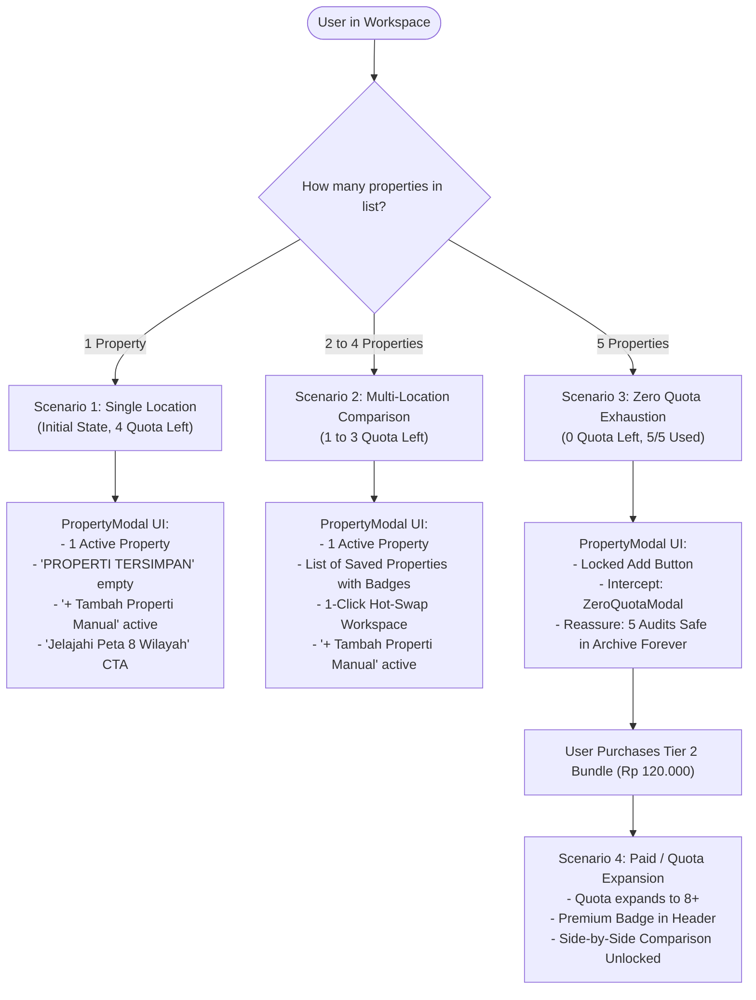

# PRD-14: Multi-Property Switcher, Quota Lifecycle & Location Scenarios

## Metadata

| Field | Value |
|---|---|
| **Document Title** | Multi-Property Switcher, Quota Lifecycle & Location Scenarios Specification |
| **Document ID** | `PRD-14` |
| **Author** | Rumper Product Management, UX Architecture & Frontend Engineering |
| **Status** | Approved / Active Production Specification |
| **Version** | 1.0 (Unified Scenarios & Lifecycle Baseline) |
| **Target Path** | [`docs/prd/PRD-14-property-modal-location-switcher.md`](file:///Users/arisandy/Downloads/Rumper%20App/rumper-web-gamification-main/docs/prd/PRD-14-property-modal-location-switcher.md) |
| **Baseline Standards** | [`PRD-00-overview-architecture.md`](file:///Users/arisandy/Downloads/Rumper%20App/rumper-web-gamification-main/docs/prd/PRD-00-overview-architecture.md), [`PRD-01-app-header-navigation.md`](file:///Users/arisandy/Downloads/Rumper%20App/rumper-web-gamification-main/docs/prd/PRD-01-app-header-navigation.md), [`PRD-04-entitlements-upgrade.md`](file:///Users/arisandy/Downloads/Rumper%20App/rumper-web-gamification-main/docs/prd/PRD-04-entitlements-upgrade.md), [`PRD-13-quota-pricing-account-management.md`](file:///Users/arisandy/Downloads/Rumper%20App/rumper-web-gamification-main/docs/prd/PRD-13-quota-pricing-account-management.md) |
| **Owning Workstreams** | `Product_Management`, `Frontend_Engineering`, `Design_System`, `Growth_Engine` |

---

## 1. Executive Summary & Problem Statement

As Indonesian first-time homebuyers evaluate multiple potential neighborhoods and candidate homes across Jabodetabek, they must seamlessly switch between active property workspaces, monitor their remaining free audit quota, explore curated corridors, and access their permanently archived due diligence reports.

This specification unifies and formalizes the end-to-end behavior of the **Multi-Property Switcher ([`PropertyModal.tsx`](file:///Users/arisandy/Downloads/Rumper%20App/rumper-web-gamification-main/src/components/PropertyModal.tsx))**, connecting it directly with the **Quota Governance Engine ([`PRD-13`](file:///Users/arisandy/Downloads/Rumper%20App/rumper-web-gamification-main/docs/prd/PRD-13-quota-pricing-account-management.md))**, the **Global App Header ([`PRD-01`](file:///Users/arisandy/Downloads/Rumper%20App/rumper-web-gamification-main/docs/prd/PRD-01-app-header-navigation.md))**, and the **Account Settings Archive Hub ([`PRD-13 Module 5`](file:///Users/arisandy/Downloads/Rumper%20App/rumper-web-gamification-main/docs/prd/PRD-13-quota-pricing-account-management.md#L198))**.

---

## 2. Core Component Architecture & Triggers

```
┌────────────────────────────────────────────────────────┐
│               Pilih Properti Aktif (Modal)             │
│ [ 3 dari 5 kuota lokasi tersisa ]                  [X] │
├────────────────────────────────────────────────────────┤
│ SEDANG AKTIF                                           │
│ 🔘 Kandidat Bintaro, Pondok Aren           INVESTIGASI │
├────────────────────────────────────────────────────────┤
│ PROPERTI TERSIMPAN                                     │
│ ⚪ Grand Galaxy City Block R, Bekasi       INVESTIGASI │
│ ⚪ Cluster Bumi Asri, Pamulang               LANJUTKAN │
│ ⚪ Griya Kencana, Beji                     INVESTIGASI │
│ ⚪ Townhouse Ampera, Kemang                      TUNDA │
├────────────────────────────────────────────────────────┤
│ 🗺️ [Jelajahi Peta 8 Wilayah Jabodetabek]                │
│ ➕ [+ Tambah Properti Manual] / [🔒 Kuota Penuh Banner]│
└────────────────────────────────────────────────────────┘
```

### 2.1 Entry Points
1. **Desktop Global Header ([`AppHeader.tsx`](file:///Users/arisandy/Downloads/Rumper%20App/rumper-web-gamification-main/src/components/AppHeader.tsx#L151-L181))**:
   - Clicking the location selector pill `[ 📍 {activePropertyName}, {activePropertySubdistrict} ⌵ ]` fires `onOpenPropertyModal()`.
2. **Mobile Sticky Subheader ([`AppHeader.tsx`](file:///Users/arisandy/Downloads/Rumper%20App/rumper-web-gamification-main/src/components/AppHeader.tsx#L233-L277))**:
   - Tapping the `"Ganti"` action text button on the top mobile bar fires `onOpenPropertyModal()`.
3. **Zero Quota Interception Modal ([`ZeroQuotaModal.tsx`](file:///Users/arisandy/Downloads/Rumper%20App/rumper-web-gamification-main/src/components/ZeroQuotaModal.tsx#L55))**:
   - Clicking `"Kembali ke Arsip Properti"` dismisses the paywall and launches `PropertyModal` to let the user select among their existing audited homes.
4. **Curated Area Loading & Handoff**:
   - Adding a new curated area or completing the onboarding wizard synchronizes the newly selected home into `propertiesList` and makes it the active workspace property.

---

## 3. Comprehensive Scenario Matrix



---

### Scenario 1: Single Property Initial State (1 Location / 4 Quota Remaining)

#### Context & User Mindset
The user has just completed the Onboarding Wizard (`ResponsiveWizardShell`) or chosen their first candidate home from the Curated Areas Map (`CuratedAreasMapScreen`). They are auditing their very first location.

#### Telemetry & UI State
* **Header Location Pill**: Displays `[ 📍 {Property Name}, {Subdistrict} ⌵ ]`.
* **Header Quota Badge**: Displays `4 lokasi tersisa` (with green pulsing indicator).
* **Inside `PropertyModal`**:
  * **`SEDANG AKTIF`**: Renders the single property with active radio button (`🔘`) and status badge (e.g. `INVESTIGASI`).
  * **`PROPERTI TERSIMPAN`**: Hidden or omitted (no secondary properties exist yet).
  * **Add Manual Property CTA (`+ Tambah Properti Manual`)**: Prominent dashed card. Clicking expands inline text fields for *Nama Properti* and *Kota / Wilayah*.
  * **Curated Areas Discovery CTA (`Jelajahi Peta 8 Wilayah Jabodetabek`)**: Primary discovery shortcut for users unsure of their next candidate address.

---

### Scenario 2: Multi-Location Comparison & Hot-Swapping (2 to 4 Properties)

#### Context & User Mindset
The user has added multiple candidate homes across different corridors (e.g., Bintaro, Pamulang, Bekasi, Depok) to compare risk scores, commute friction, and flood safety.

#### Telemetry & UI State
* **Header Quota Badge**: Displays dynamic remaining quota (e.g., `2 lokasi tersisa` for 3 added properties).
* **Inside `PropertyModal`**:
  * **`SEDANG AKTIF`**: Shows the current workspace property with `🔘` radio button.
  * **`PROPERTI TERSIMPAN`**: Displays all other saved properties in vertical sequence:
    * Property Name & Location (`{subdistrict}, {city}`).
    * Status Verdict Pill (`LANJUTKAN` / `INVESTIGASI` / `TUNDA`).
    * Hover highlight (`hover:border-slate-300 hover:bg-slate-50`).

#### Workspace Hot-Swap Sync Loop
When the user clicks any item in `PROPERTI TERSIMPAN`:
1. `onSelectProperty(targetPropertyId)` is invoked.
2. `activePropertyId` in `App.tsx` updates immediately.
3. The modal automatically closes (`onClose()`).
4. The entire workspace synchronously switches context:
   - **Interactive Map ([`MapPanel.tsx`](file:///Users/arisandy/Downloads/Rumper%20App/rumper-web-gamification-main/src/components/MapPanel.tsx))**: Pans and re-centers (`map.flyTo`) to the target property coordinates `latLng`.
   - **Score Card ([`ScoreCard.tsx`](file:///Users/arisandy/Downloads/Rumper%20App/rumper-web-gamification-main/src/components/ScoreCard.tsx))**: Re-renders circular SVG gauge, verdict badge, and dealbreaker red flags.
   - **5 Risk Factors ([`FactorRisksCard.tsx`](file:///Users/arisandy/Downloads/Rumper%20App/rumper-web-gamification-main/src/components/FactorRisksCard.tsx))**: Updates progress bars and environmental risk scores.
   - **Commute Workspace ([`CommuteWorkspace.tsx`](file:///Users/arisandy/Downloads/Rumper%20App/rumper-web-gamification-main/src/components/CommuteWorkspace.tsx))**: Recalculates multimodal transit polylines and bottleneck junctions to the user's primary office.
   - **Checklist Workspace ([`ChecklistWorkspace.tsx`](file:///Users/arisandy/Downloads/Rumper%20App/rumper-web-gamification-main/src/components/ChecklistWorkspace.tsx))**: Loads property-specific inspection items and user field notes.
   - **AI Assistant ([`AssistantDrawer.tsx`](file:///Users/arisandy/Downloads/Rumper%20App/rumper-web-gamification-main/src/components/AssistantDrawer.tsx))**: Injects the new property name, flood zone, and score into conversation context.

---

### Scenario 3: Zero Quota Exhaustion (5/5 Free Locations Consumed)

#### Context & User Mindset
The user has evaluated 5 properties using their free trial allotment and attempts to add a 6th property.

#### Quota Governance Rules ([PRD-13 §2 & §4.4](file:///Users/arisandy/Downloads/Rumper%20App/rumper-web-gamification-main/docs/prd/PRD-13-quota-pricing-account-management.md#L181))
* **Immutable Consumption**: Evaluating 5 properties uses 5 slots. Deleting properties does *not* refund quota slots.
* **Lifetime Archival Guarantee**: All 5 evaluated properties remain **accessible and switchable forever** without any subscription or charge.

#### Telemetry & UI State
* **Header Quota Badge**: Changes to amber pill: `Kuota penuh (5/5)`.
* **Inside `PropertyModal`**:
  * **Add Manual Property Button**: Transforms from dashed add button into an amber paywall trigger:
    ```
    [ 🔒 Kuota lokasi penuh (5/5). Upgrade untuk tambah lokasi ]
    ```
  * Clicking this button dismisses `PropertyModal` and launches **[`ZeroQuotaModal.tsx`](file:///Users/arisandy/Downloads/Rumper%20App/rumper-web-gamification-main/src/components/ZeroQuotaModal.tsx)**.

#### Paywall Interception Flow ([`ZeroQuotaModal.tsx`](file:///Users/arisandy/Downloads/Rumper%20App/rumper-web-gamification-main/src/components/ZeroQuotaModal.tsx))
* **Headline**: *"Batas Kuota Gratis Tercapai (5/5 Lokasi)"*
* **Body**: *"Kamu telah menggunakan seluruh 5 kuota audit lokasi gratis. 5 properti yang telah kamu investigasi tetap tersimpan seumur hidup di Arsip Propertimu."*
* **Action Choices**:
  1. `[Beli 3-Property Shortlist Bundle (Rp 120.000)]` *(Primary Green CTA)*: Expands total quota by +3 and unlocks side-by-side comparison.
  2. `[Buka 1 Lokasi Ini Saja (Rp 50.000)]` *(Secondary Slate CTA)*.
  3. `[Kembali ke Arsip Properti]` *(Text Link)*: Safely returns user to `PropertyModal` to continue reviewing existing saved properties.

---

### Scenario 4: Paid / Quota Expansion Tiers (Tier 1, Tier 2, Tier 3)

#### Entitlement State Matrix ([PRD-04](file:///Users/arisandy/Downloads/Rumper%20App/rumper-web-gamification-main/docs/prd/PRD-04-entitlements-upgrade.md) & [PRD-13](file:///Users/arisandy/Downloads/Rumper%20App/rumper-web-gamification-main/docs/prd/PRD-13-quota-pricing-account-management.md))

| Feature / Capability | Free Trial (Default) | Tier 1: Single Pass (`Rp 50k`) | Tier 2: Shortlist Bundle (`Rp 120k`) | Tier 3: Certified Analyst (`Rp 350k`) |
|---|---|---|---|---|
| **Max Quota Capacity** | 5 Locations | 5 Locations (1 Full Unlock) | **8 Locations (+3 Slots)** | **8 Locations (+3 Slots)** |
| **Header Badge** | `Free Trial` | `Premium` | `Premium` | `Premium · Analyst` |
| **Workspace Tahap 2–5** | Locked (`🔒`) | Unlocked for 1 property | **Unlocked for 3 properties** | **Unlocked for all + Human GIS** |
| **Side-by-Side Matrix** | Locked | Locked | **Unlocked (`AreaComparisonModal`)** | **Unlocked** |
| **PDF Brief Export** | Locked | Locked | **Unlocked (3-Page Report)** | **Unlocked (Analyst Certified)** |
| **Human Consultation** | N/A | N/A | N/A | **30-min WhatsApp + 24h SLA** |

---

### Scenario 5: Dual Entry Points – Modal Switcher vs Account Settings Archive Tab

The application provides two complementary property management interfaces tailored to user context:

```
┌────────────────────────────────────────┬────────────────────────────────────────┐
│ 1. Quick Switcher (PropertyModal)      │ 2. Full Archive (AccountSettingsHub)   │
├────────────────────────────────────────┼────────────────────────────────────────┤
│ • Fast pop-up dialog from navbar       │ • Full-screen management dashboard     │
│ • Optimized for 1-click workspace swap │ • Filter chips (Semua, Investigasi...) │
│ • Inline Add Property Form             │ • Large BNPB Risk Score Badges         │
│ • Quota countdown badge                │ • "Buka di Workspace ➔" CTA button     │
│ • Curated Areas Map shortcut           │ • Family Share Link & PDF Generator    │
└────────────────────────────────────────┴────────────────────────────────────────┘
```

---

### Scenario 6: Mobile Subheader & Responsive Adaptations

1. **Auto-Hide Behavior ([`AppHeader.tsx`](file:///Users/arisandy/Downloads/Rumper%20App/rumper-web-gamification-main/src/components/AppHeader.tsx#L105-L113))**:
   - When scrolling down (>20px), the mobile location subheader smoothly transitions to `max-h-0 opacity-0 py-0` to maximize map and workspace viewport height.
   - When scrolling back to top (<=20px), it smoothly expands to `max-h-16 opacity-100 py-2.5 px-4`.
2. **Bottom Sheet Rendering**:
   - On screens `<640px`, `PropertyModal` automatically docks to the bottom viewport (`rounded-t-3xl`, top drag handle `w-12 h-1.5 bg-slate-300`) preventing awkward keyboard zoom during property addition.

---

## 4. Technical Specs & TypeScript Contracts

### 4.1 `PropertyModalProps` ([`src/components/PropertyModal.tsx`](file:///Users/arisandy/Downloads/Rumper%20App/rumper-web-gamification-main/src/components/PropertyModal.tsx#L15-L26))

```typescript
export interface PropertyModalProps {
  isOpen: boolean
  onClose: () => void
  properties: PropertyLocation[]
  activePropertyId: string
  onSelectProperty: (id: string) => void
  onAddProperty: (name: string, location: string) => void
  totalQuota: number
  remainingQuota: number
  onOpenUpgrade: () => void
  onOpenCuratedAreas?: () => void
}
```

### 4.2 `PropertyLocation` Data Model ([`src/data/mockProperties.ts`](file:///Users/arisandy/Downloads/Rumper%20App/rumper-web-gamification-main/src/data/mockProperties.ts#L1-L18))

```typescript
export interface PropertyLocation {
  id: string
  name: string
  subdistrict: string
  city: string
  status: "INVESTIGASI" | "LANJUTKAN" | "TUNDA"
  statusBadge: "warning" | "success" | "danger"
  score: number
  riskSummary: string
  evidenceCount: number
  gapCount: number
  active?: boolean
  latLng?: [number, number]
  elevationDpl?: string
  areaId?: string
  commuteMinutes?: number
  priceRange?: string
}
```

---

## 5. Acceptance Criteria Checklist

- [x] **FR-PM01 (Navbar Trigger)**: Clicking the location pill in `AppHeader.tsx` or `"Ganti"` in the mobile subheader opens `PropertyModal`.
- [x] **FR-PM02 (Single-Property State)**: When only 1 property exists in `propertiesList`, `SEDANG AKTIF` displays the property and `PROPERTI TERSIMPAN` gracefully hides without layout breakage.
- [x] **FR-PM03 (Multi-Property Switching)**: Clicking any saved property immediately hot-swaps `activePropertyId`, re-centers Leaflet map, updates risk scores, and closes the modal.
- [x] **FR-PM04 (Quota Indicator)**: Modal displays accurate live quota counter (`remainingQuota` out of `totalQuota`).
- [x] **FR-PM05 (Manual Addition)**: When quota $> 0$, inline form allows adding new property by name & subdistrict/city.
- [x] **FR-PM06 (Zero Quota Interception)**: When quota $= 0$, manual addition is locked and directs user to `ZeroQuotaModal` / `UpgradeDrawer`.
- [x] **FR-PM07 (Curated Area Direct Link)**: Clicking `"Jelajahi Peta 8 Wilayah Jabodetabek"` navigates to `CuratedAreasMapScreen`.
- [x] **FR-PM08 (Mobile Ergonomics)**: Renders as slide-up bottom sheet on mobile screens with top pull handle.
