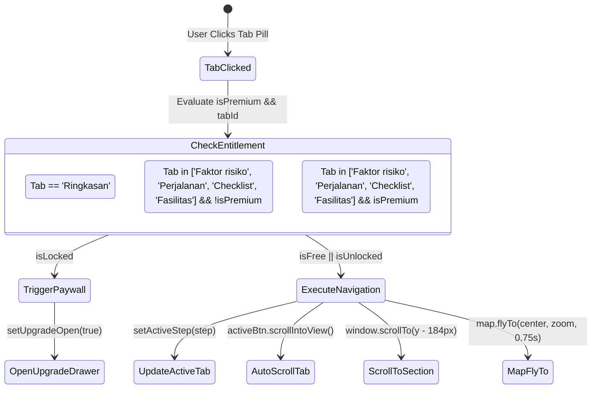

# Microinteractions & Motion Specification: Tab Navigation & Section Switching

**Document ID:** `SPEC-NAV-01`  
**Status:** Approved Active Specification  
**Source Code References:** [`SubHeaderTabs.tsx`](file:///Users/arisandy/Downloads/Rumper%20App/rumper-web-gamification-main/src/components/SubHeaderTabs.tsx), [`App.tsx`](file:///Users/arisandy/Downloads/Rumper%20App/rumper-web-gamification-main/src/App.tsx), [`MapPanel.tsx`](file:///Users/arisandy/Downloads/Rumper%20App/rumper-web-gamification-main/src/components/MapPanel.tsx), [`VerticalTimeline.tsx`](file:///Users/arisandy/Downloads/Rumper%20App/rumper-web-gamification-main/src/components/VerticalTimeline.tsx)  

---

## 1. Executive Summary & Interaction Overview

The Tab Navigation Menu provides a synchronized dual-loop interface connecting tab pill selection, smooth window scrolling, dynamic timeline node tracking, and spatial map camera transitions (`map.flyTo`).

When a user interacts with the tab menu:
1. **Visual Micro-Feedback:** Immediate 150ms active-scale press feedback (`scale(0.96)`).
2. **Access Gating Evaluation:** Unlocked tabs execute smooth scroll; locked tabs trigger the `UpgradeDrawer` paywall.
3. **Auto-Scroll & Offset Correction:** Window smoothly scrolls to target section with `184px` sticky header clearance.
4. **Spatial Map Telemetry Sync:** Leaflet map camera animates center and zoom (`0.75s` `flyTo`) to reveal section-relevant GIS layers.
5. **Bi-Directional Scroll Spy:** `IntersectionObserver` updates active tab state while user scrolls manually.

---

## 2. Microinteractions & Animation Spec

| Interaction State | Visual Property & Style | Motion Duration | Easing Curve / Function | Physical Feeling |
| :--- | :--- | :--- | :--- | :--- |
| **Tab Hover (Unlocked)** | `hover:bg-slate-100/80` | `150ms` | `cubic-bezier(0, 0, 0.2, 1)` | Subtle surface highlight |
| **Tab Hover (Locked)** | `hover:bg-white/80` | `150ms` | `cubic-bezier(0, 0, 0.2, 1)` | Tactile dashed lock affordance |
| **Tab Active Press** | `active:scale-[0.96]` | `100ms` | `cubic-bezier(0.25, 0.46, 0.45, 0.94)` | Tactile spring press |
| **Tab Activation Morph** | `bg-[#0F2B38] text-white shadow-2xs` | `150ms` | `ease-out-decel` | High-contrast dark pill lock-in |
| **Tab Auto-Centering** | `scrollIntoView({ behavior: 'smooth' })` | `300ms` | `smooth` | Fluid horizontal scroll centering |
| **Section Smooth Scroll**| `window.scrollTo({ behavior: 'smooth' })` | `600ms – 900ms` | `native smooth` | Calm, weighted vertical gliding |
| **Map Camera FlyTo** | `map.flyTo(center, zoom)` | `750ms` | `easeLinearity: 0.25` | Cinematic camera flight |
| **Timeline Node Shift** | `ResizeObserver` top offset sync | `Instant / Frame` | `requestAnimationFrame` | Rigid physical line alignment |

---

## 3. Tab State Machine & Access Gating Logic



---

## 4. Programmatic Navigation & Offset Calculation Spec

### 4.1 Sticky Clearance Formula
To prevent fixed headers from obscuring section headings, programmatic scroll calculates target top offsets using `STICKY_OFFSET`:

$$\text{STICKY\_OFFSET} = \text{AppHeader Height} (52\text{px}) + \text{SubHeaderTabs Height} (124\text{px}) + \text{Visual Clearance} (8\text{px}) = 184\text{px}$$

$$\text{Target } Y = \text{ref.current.getBoundingClientRect().top} + \text{window.scrollY} - \text{STICKY\_OFFSET}$$

```typescript
const STICKY_OFFSET = 184

const navigateToStep = useCallback((step: WorkspaceStep) => {
  if (!isPremiumRef.current && step !== 'ringkasan') {
    setUpgradeOpen(true)
    return
  }
  setActiveStep(step)

  const isMobile = window.innerWidth < 1024
  const refs = isMobile ? mobileSectionRefs : desktopSectionRefs
  const offset = isMobile ? 112 : STICKY_OFFSET
  const ref = refs[step]

  if (ref.current) {
    isNavigating.current = true
    const y = ref.current.getBoundingClientRect().top + window.scrollY - offset
    window.scrollTo({ top: Math.max(0, y), behavior: 'smooth' })
    
    // Lock scroll spy during smooth scroll transition
    setTimeout(() => { isNavigating.current = false }, 900)
  }
}, [mobileView])
```

---

## 5. Bi-Directional Scroll Spy (IntersectionObserver)

To keep tab navigation in sync while users scroll manually, an `IntersectionObserver` tracks active workspace sections:

- **Root Margin:** `-20% 0px -55% 0px` (Desktop) / `-15% 0px -60% 0px` (Mobile).
- **Navigation Lock (`isNavigating.current`):** Temporarily ignores scroll events for `900ms` during programmatic tab clicks to prevent tab pill flicker/jitter.
- **Active Pill Auto-Focus:** When `activeStep` updates, `SubHeaderTabs` triggers:
  ```typescript
  activeBtn.scrollIntoView({ behavior: 'smooth', block: 'nearest', inline: 'center' })
  ```

---

## 6. Map Camera Telemetry Sync Matrix

Every tab selection automatically dispatches spatial telemetry updates to `<MapPanel />`:

```typescript
const TAB_CONFIG: Record<string, { center: [number, number]; zoom: number; infoLabel: string; infoSub: string; infoColor: string }> = {
  Ringkasan:       { center: [-6.266, 106.990], zoom: 15, infoLabel: 'Flood Zone Evidence',    infoSub: 'BNPB 2024 · 95m from property',        infoColor: '#E12626' },
  'Faktor risiko': { center: [-6.263, 106.990], zoom: 14, infoLabel: 'Zona Risiko Aktif',      infoSub: '2 layer risiko terdeteksi',             infoColor: '#EA580C' },
  Perjalanan:      { center: [-6.255, 106.985], zoom: 12, infoLabel: '4 rute tersedia',        infoSub: 'KRL · Tol · Arteri · Sekolah',          infoColor: '#2563EB' },
  Checklist:       { center: [-6.266, 106.990], zoom: 15, infoLabel: 'Radius Jalan Kaki 500m', infoSub: '4 fasilitas esensial terjangkau',       infoColor: '#16A34A' },
  Fasilitas:       { center: [-6.263, 106.990], zoom: 13, infoLabel: '7 fasilitas ditemukan',  infoSub: 'Sekolah · RS · Mall · Taman · Ibadah', infoColor: '#7C3AED' },
}
```

---

## 7. Dynamic Vertical Timeline Node Alignment

The left vertical timeline (`VerticalTimeline.tsx`) dynamically re-calculates checkmark and lock node positions on layout changes using `ResizeObserver`:

```typescript
useEffect(() => {
  function measure() {
    if (!containerRef.current) return
    const parentTop = containerRef.current.getBoundingClientRect().top
    const refs = [s1Ref, s2Ref, s3Ref, s4Ref, s5Ref]

    const positions = refs.map((ref, i) => {
      if (ref.current) {
        return ref.current.getBoundingClientRect().top - parentTop + 16
      }
      return 20 + i * 160
    })
    setNodePositions(positions)
  }

  measure()
  window.addEventListener('resize', measure)
  const observer = new ResizeObserver(() => measure())
  if (containerRef.current) observer.observe(containerRef.current)
  return () => { window.removeEventListener('resize', measure); observer.disconnect() }
}, [isPremium])
```

---

## 8. Mobile Sheet Snap Interaction (<1024px)

On mobile viewports:
1. If the user is currently viewing the map panel (`mobileView === 'map-panel'`) and taps a tab pill.
2. The bottom sheet automatically expands to full viewport height (`setSheetSnap('full')`).
3. After `60ms`, it smooth-scrolls to the target section container inside `MobileBottomSheet`.
