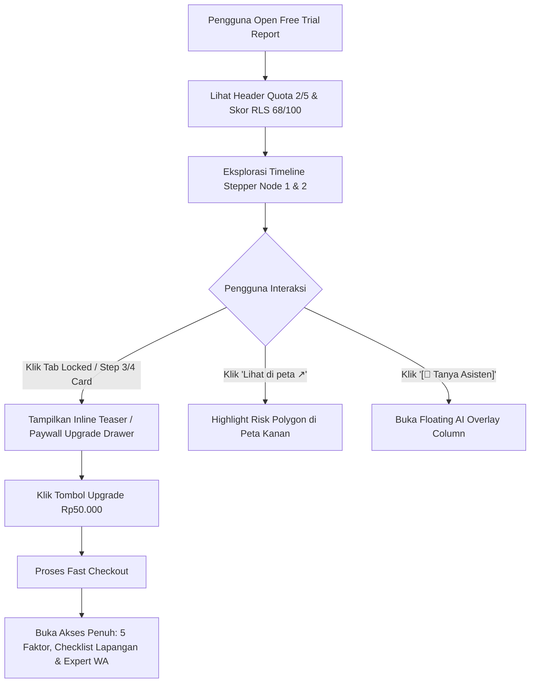

# PRD: Core Workspace — Free Trial Gamification & Due Diligence Stepper

> [!NOTE]  
> This PRD extends the baseline [`docs/prd/core-workspace/core-workspace.md`](file:///Users/arisandy/Downloads/rumper/docs/prd/core-workspace/core-workspace.md) specifically for the **Free Trial user journey**. It incorporates the **Due Diligence Readiness Stepper**, high-converting paywall hooks, and quota management while maintaining strict decision safety rules.

## Metadata

| Field | Value |
|-------|-------|
| **Author** | Antigravity AI & Product Team |
| **Status** | Proposed / Review |
| **Created** | 2026-08-07 |
| **Baseline Doc** | [`docs/prd/core-workspace/core-workspace.md`](file:///Users/arisandy/Downloads/rumper/docs/prd/core-workspace/core-workspace.md) |
| **Version** | 1.0 |
| **Target Module** | `gamification-workspace` (Free Trial Analysis Region & Map Sync) |
| **Related Docs** | [`docs/16-workspace-shell-and-analysis.md`](../../16-workspace-shell-and-analysis.md), [`docs/09-frontend.md`](../../09-frontend.md), [`docs/prd/core-workspace/free-trial-gamification-stepper.md`](../core-workspace/free-trial-gamification-stepper.md), [`AGENTS.md`](../../../AGENTS.md) |

---

## 1. Problem Statement & Core Objectives

### 1.1 Problem Statement
First-time home buyers in Jabodetabek using the free trial of Rumper need an engaging, step-by-step framework to digest complex geospatial risk data (flood zones, commute times, fault lines, infrastructure) without feeling overwhelmed. 

While the core workspace baseline provides structured spatial analysis, free trial users often leave before understanding the depth of Rumper's research. A pure paywall blocks user trust, whereas unguided text reports fail to highlight the tangible value of upgrading to a full report.

### 1.2 Core Objectives
- **Increase Engagement & Comprehension**: Guide users through a 4-step **Due Diligence Readiness Stepper** that visually tracks their property evaluation progress.
- **Drive Free-to-Paid Conversion**: Create clear, high-perceived-value triggers (*Rp50.000* promo from *Rp150.000*) for unlocking deep risk factors, field inspection checklists, and expert analyst consultations.
- **Maintain Quota Discipline**: Enforce a transparent quota system (*2 dari 5 lokasi digunakan*) for trial users.

### 1.3 Core Business & UX Safeguards (Non-Negotiable)

> [!IMPORTANT]
> 1. **Decision Safety Rule (STD-SCR-001 §7)**: Critical Red Flags (e.g., major flood hazards or SUTET proximity) **must never be hidden completely** behind a paywall. High-level Red Flag warnings must always remain visible in the Free Overview tab so users do not make dangerous financial assumptions.
> 2. **Professional Buyer-Side Tone**: All UI copy must use transaction-readiness terminology such as **"Tingkat Kesiapan Due Diligence"** or **"Kesiapan Inspeksi Lapangan"**. Casual gaming terms (e.g., "XP", "Leveling", "Badges") are strictly prohibited to preserve trust in multi-hundred-million-Rupiah real estate decisions.
> 3. **AI Subordination**: AI chat is on-demand (`[💬 Tanya Asisten]` overlay) and strictly grounded in the generated factsheet. It does not replace visual spatial evidence.

---

## 2. Goals & Success Metrics

| # | Goal | Metric | Target |
|---|------|--------|--------|
| G1 | Increase report engagement | Free Trial Session Duration | > 2.5 minutes spent exploring stepper & map |
| G2 | Maximize Stepper progress | Step 1 & 2 completion rate | > 80% of trial users review Step 1 & 2 cards |
| G3 | Drive conversion intent | Upgrade CTA click rate | > 15% click rate on dark upgrade banner / locked tabs |
| G4 | Safety & zero hallucination | Critical Red Flag clarity | 100% of major hazards surfaced in free summary |

---

## 3. Layout & Architecture Overview

### 3.1 2-Column Desktop Grid Layout

The workspace adopts a balanced two-region layout with an overlay column for the AI assistant and a top global navigation header:

```
┌────────────────────────────────────────────────────────────────────────┐
│ Global Navigation Bar (72px)                                            │
│ [Brand Logo] [Free Trial] │ [Location Dropdown] [2/5 Quota] [Avatar]   │
├────────────────────────────────────┬───────────────────────────────────┤
│ Left Column: Analysis & Stepper    │ Right Column: Interactive Map     │
│ ~50% (flex-shrink)                 │ ~50% (flex-grow)                  │
│ ├─ Sticky Tabs (Ringkasan/Locked)  │ ├─ Overlay Controls & [Perluas]   │
│ ├─ Vertical Stepper Timeline Line  │ ├─ Layer Toggles (Flood/POI/Circle)│
│ ├─ Card 1: Skor RLS (68/100)       │ └─ Leaflet Map Canvas             │
│ ├─ Card 2: Teaser Faktor Risiko    │                                   │
│ ├─ Floating Upgrade Banner         │                                   │
│ └─ Card 4: Locked Step 4 Teaser    │                                   │
└────────────────────────────────────┴───────────────────────────────────┘

When AI Assistant is invoked ([💬 Tanya Asisten]):
┌────────────────────────────────────────────────────────────────────────┐
│ Global Header (72px)                                                   │
├───────────────┬──────────────────────────┬─────────────────────────────┤
│ Stepper &     │ Floating AI Overlay      │ Interactive Map             │
│ Analysis      │ ~380px (middle column)   │ (compressed)                │
└───────────────┴──────────────────────────┴─────────────────────────────┘
```

---

## 4. Component Specification

### 4.1 Global Header Elements
- **Brand Mark**: Rumper logo + Pill badge `Free Trial` (`bg-teal-500/10`, `text-teal-700`).
- **Location Selector Dropdown**: Menampilkan nama lokasi aktif (`Grand Galaxy City Blok R, Bekasi Selatan ▾`). Triggers location switching.
- **Quota Counter Badge**: `2 dari 5 lokasi digunakan` (`bg-slate-100`, `text-slate-700`).
- **User Profile Avatar**: Quick access to account settings and token balance (`/app/akun`).

### 4.2 Sub-Header & Sticky Tabs
- **Tab Items**:
  1. `Ringkasan` *(Active — White outline pill badge with solid indicator)*
  2. `Faktor risiko 🔒` *(Locked tab — Triggers Paywall Drawer)*
  3. `Perjalanan 🔒` *(Locked tab — Triggers Paywall Drawer)*
  4. `Checklist 🔒` *(Locked tab — Triggers Paywall Drawer)*
- **Action Button (Right-aligned)**: `[💬 Tanya Asisten]` blue-outlined pill button to slide in the floating AI overlay column.

### 4.3 Vertical Timeline Line (Left-side Stepper)
A continuous vertical line linking circular node indicators:
- **Node 1 (Completed)**: Teal/green circle with checkmark `[✓]` — *Indeks Risiko Lokasi*.
- **Node 2 (Completed)**: Teal/green circle with checkmark `[✓]` — *Identifikasi Critical Red Flag*.
- **Node 3 (Locked)**: Muted slate circle with lock icon `[🔒]` — *Analisis Mendalam 5 Faktor Risiko*.
- **Node 4 (Locked)**: Muted slate circle with lock icon `[🔒]` — *Verifikasi Red Flag & Checklist Lapangan*.

---

### 4.4 Card Breakdown (Tab Ringkasan)

#### Card 1: Indeks Risiko Lokasi (Free)
- **RLS Score Ring**: Circular progress ring showing `68 /100` (uses neutral band-tinted color, **not brand green**, to reflect objective audit stance).
- **Verdict Badge**: `Layak dengan catatan` (`bg-amber-50`, `text-amber-700`).
- **Summary Text**: *"Skor keseluruhan berada pada band Layak dengan catatan, tetapi critical red flag banjir dan evidence gap lingkungan tetap harus ditindaklanjuti."*
- **Evidence Badge**: `● Data sedang` *"Berdasarkan 6 sumber data terverifikasi"*.

#### Card 2: Teaser Faktor Risiko (Free Overview)
- Surfaces 5 primary factors with progress bars and status tags:
  1. **Banjir**: `42/100` · `Risiko Utama` · `2 bukti • 1 gap` (`Data sedang`).
  2. **Perjalanan**: `58/100` · `1 bukti belum ditinjau` (`Data sedang`).
  3. **Akses fisik**: `67/100` · `Belum ditinjau` (`Perlu validasi`).
  4. **Fasilitas**: `78/100` · `Belum ditinjau` (`Data kuat`).
  5. **Lingkungan**: `-` · `Bukti belum mencukupi` (`Perlu validasi`).
- **Expand Toggle**: `Tampilkan semua faktor ▾` expands/collapses the factor list.

#### Floating Dark Upgrade Banner (Paywall Trigger)
- **Container**: Dark teal container (`bg-[#061E28]` / `slate-900`) floating between Card 2 and Card 4.
- **Copy**: *"Buka laporan lengkap"* + subtext *"Akses 5 faktor risiko, checklist inspeksi, & konsul analis"*.
- **Price Anchor**: Promo price `Rp50.000` with strikethrough `<del>Rp150.000</del>`.
- **Primary CTA**: Tombol `[Upgrade]` hijau brand (`bg-emerald-500 hover:bg-emerald-600 text-white font-semibold`).

#### Card 4: Locked Step 4 Teaser
- **Header Note**: `🔒 Terbuka setelah upgrade`.
- **Title**: `Tahap 4 · Verifikasi Red Flag (Earthquake / Fault Proximity)`.
- **Risk Badge**: `● High Risk` red pill badge.
- **Action Button**: `Lihat di peta ↗` pill button which highlights the corresponding Red Flag polygon/marker on the right map workspace.

---

### 4.5 Map Workspace Panel (Right Column)

- **Map Engine**: Leaflet + OpenStreetMap tiles.
- **Top Overlay Controls**:
  - `Map Layers` dropdown
  - Layer Toggles: `Flood`, `POI Markers`, `Radius Circle`
  - Action CTA: `[⛶ Perluas Peta]` (Full-screen map modal)
- **Interactive Layer Elements**:
  - Red risk polygon covering flood hazard zones (e.g., Grand Galaxy risk area).
  - Dashed radius circles (e.g., ±3 km radius).
  - Custom POI pins (Red Alert pin, School, Shop, Water body pins).
- **POI Popup Card**: Clicking a pin displays target distance, AI claim summary, evidence confidence badge (`Data Kuat` / `Perlu Validasi`), and field validation checklist steps.

---

## 5. User Interaction & State Flow



---

## 6. Edge Cases & Responsive Behavior

| Case | Scenario | Expected UI Handling |
|------|----------|----------------------|
| **Missing Category Score** | `score === null` (e.g., Lingkungan) | Displays `-` with gray placeholder bar and `Perlu validasi` badge. |
| **Critical Red Flag Override** | High overall score with severe local flood risk | Surfaces red `Risiko Utama` badge and red risk polygon on map despite overall score. |
| **Long Location Name** | E.g., `Grand Galaxy City Blok R, Bekasi Selatan, Jawa Barat` | Truncates gracefully with ellipsis (`Grand Galaxy City... ▾`). |
| **Mobile Screen (<1024px)** | Responsive viewport | Switches to single-column stacked view with sticky top progress bar and floating `[Peta Risiko]` drawer toggle. |

---

## 7. Implementation & PR Breakdown

| # | PR Scope | Estimated Lines | Dependencies | Key Deliverables |
|---|----------|-----------------|--------------|------------------|
| 1 | Header & Stepper Shell | ~350 lines | None | Global Header with Quota badge, Location Picker, Sub-header tabs, and Vertical Timeline component. |
| 2 | Free Cards & Upgrade Banner | ~550 lines | PR 1 | ScoreCard (Card 1), FactorRisksTeaser (Card 2 with expand toggle), Dark Upgrade Banner, and LockedStep4Card (Card 4). |
| 3 | Interactive Map Sync | ~450 lines | PR 1 | Leaflet map with layer toggles, red risk polygons, POI pins, and `Lihat di peta ↗` handler. |
| 4 | Paywall Modal & AI Overlay Integration | ~400 lines | PR 2, PR 3 | Paywall Drawer trigger on locked elements, `[💬 Tanya Asisten]` middle column overlay slide-in. |

---

## 8. Verification & Acceptance Criteria

- [ ] Baseline file [`docs/prd/core-workspace/core-workspace.md`](file:///Users/arisandy/Downloads/rumper/docs/prd/core-workspace/core-workspace.md) remains 100% untouched.
- [ ] 2-column layout matches the specified UI architecture with 50/50 proportion.
- [ ] Continuous vertical timeline correctly displays completed check nodes (`[✓]`) and locked nodes (`[🔒]`).
- [ ] Critical Red Flags remain surfaced in Free Overview per Decision Safety Rule (STD-SCR-001 §7).
- [ ] Click on locked tabs or locked cards opens the Paywall Upgrade Drawer with Rp50.000 price anchor.
- [ ] Clicking `Lihat di peta ↗` on Card 4 highlights the Red Flag hazard polygon on the Leaflet map panel.
- [ ] Language strictly adheres to Bahasa Indonesia with calm, evidence-focused tone.
